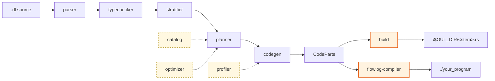
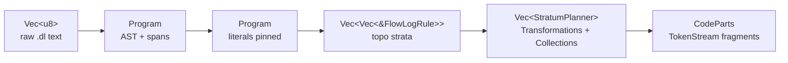

# Architecture

A single page that ties everything together. Use this as the **map**: every stage links to its own README.

## Pipeline



Five sequential stages on the spine; three support modules feed in (catalog & optimizer **inside** the planner; profiler **inside** codegen).

| # | Stage | One-line role | README |
|---|---|---|---|
| 1 | `parser` | Pest grammar → typed AST; resolves `.include`. | [→](crates/flowlog-build/src/parser/README.md) |
| 2 | `typechecker` | Reject ill-typed programs; pin every literal to a concrete width. | [→](crates/flowlog-build/src/typechecker/README.md) |
| 3 | `stratifier` | SCC-based scheduling; loop / fixpoint blocks are hard barriers. | [→](crates/flowlog-build/src/stratifier/README.md) |
| 4 | `planner` | Per-rule pipeline (`prepare → SIP* → core → fuse → post`) + stratum dedup. Builds a `Catalog` per rule and consults the `Optimizer` for join order. | [→](crates/flowlog-build/src/planner/README.md) |
| 5 | `codegen` | Emit Timely + DD operator chains as `CodeParts` token streams. | [→](crates/flowlog-build/src/codegen/README.md) |
| — | `catalog` | Per-rule metadata (signatures, supersets, filters); built per-rule by the planner. | [→](crates/flowlog-build/src/catalog/README.md) |
| — | `optimizer` | EDB cardinalities + plan tree (today: left-deep, source order). | [→](crates/flowlog-build/src/optimizer/README.md) |
| — | `profiler` | Operator-level trace. Datalog modes only — panics under `extend-*`. | [→](crates/flowlog-build/src/profiler/README.md) |
| — | `common` | Source spans, diagnostics, `Config`, fingerprints. Used by every stage. | [→](crates/flowlog-build/src/common/README.md) |

## Two output paths

`CodeParts` is consumed by either of two frontends:

| Path | Module | Output |
|---|---|---|
| **Library** | [`build/`](crates/flowlog-build/src/build/README.md) (inside `flowlog-build`) | `$OUT_DIR/<stem>.rs` for `include!()` from your crate. |
| **Binary** | [`flowlog-compiler/`](crates/flowlog-compiler/README.md) | A scaffolded Cargo project + `cargo build --release` + a binary. |

The runtime crate ([`flowlog-runtime`](crates/flowlog-runtime/README.md)) supplies what generated code calls into: string interning, file-IO sharding, `k_way_merge` / `topk`, and `Transaction` state.

## Mode matrix

|              | Batch *(run once)*           | Incremental *(maintain)*       |
|--------------|------------------------------|--------------------------------|
| **Datalog**  | `datalog-batch` *(default)* ✅ | `datalog-inc` ✅                |
| **Extended** | `extend-batch` 🚧             | `extend-inc` 🚧                 |

Extended modes add `loop { … }` / `fixpoint { … }` for explicit recursion control. Status: parser, planner and codegen accept the syntax; `extend-batch` has six unit fixtures; `extend-inc` has none yet. `--profile` is incompatible with either extended sub-mode.

`Config::mode` flows through to:

- **stratifier** — rejects non-loop recursion in extended mode (`StratifyError::RecursionOutsideLoop`);
- **codegen** — picks `Diff = Present` for `datalog-batch`, `Diff = i32` elsewhere;
- **codegen** — wraps recursive strata in `.iterate(...)` (batch) or `Variable` scopes (incremental);
- **build assemblers** — `engine/batch.rs` emits a `DatalogBatchEngine.run()`; `engine/incremental.rs` emits a `DatalogIncrementalEngine` driven by `Transaction::commit()`.

## Data flowing between stages



A `u64` fingerprint (see [`common/`](crates/flowlog-build/src/common/README.md)) threads through `catalog → planner → codegen`, so the same logical collection is arranged once and shared across rules.

## Repository layout

```
flowlog/
├── README.md            project pitch + Quick Start
├── ARCHITECTURE.md      ← you are here
├── crates/
│   ├── flowlog-build/   compile pipeline (library); each src/ submodule has its own README
│   ├── flowlog-compiler/ standalone CLI binary
│   └── flowlog-runtime/ runtime helpers consumed by generated code
├── example/             .dl programs (graph_analysis, knowledge_reasoning, ldbc_snb, program_analysis, extended)
└── tests/               unit / complex / ldbc end-to-end suites
```

## Reading order

If you want to understand how a `.dl` becomes an executable:

1. [`parser/`](crates/flowlog-build/src/parser/README.md) — AST + `Lexeme` trait.
2. [`typechecker/`](crates/flowlog-build/src/typechecker/README.md) — the **pin** mechanic.
3. [`stratifier/`](crates/flowlog-build/src/stratifier/README.md) — strata + loop blocks.
4. [`planner/`](crates/flowlog-build/src/planner/README.md) — biggest module; the `Transformation` IR. Cross-reference [`catalog/`](crates/flowlog-build/src/catalog/README.md) and [`optimizer/`](crates/flowlog-build/src/optimizer/README.md) as needed.
5. [`codegen/`](crates/flowlog-build/src/codegen/README.md) — IR → Rust + Timely + DD code.
6. Pick one of [`build/`](crates/flowlog-build/src/build/README.md) or [`flowlog-compiler/`](crates/flowlog-compiler/README.md) for the final-output side.
7. [`common/`](crates/flowlog-build/src/common/README.md) and [`profiler/`](crates/flowlog-build/src/profiler/README.md) — look up as needed.

## Background reading

> **FlowLog: Efficient and Extensible Datalog via Incrementality** \
> Hangdong Zhao, Zhenghong Yu, Srinag Rao, Simon Frisk, Zhiwei Fan, Paraschos Koutris \
> VLDB 2026 — [pVLDB](https://www.vldb.org/pvldb/vol19/p361-zhao.pdf) · [artifacts](https://github.com/flowlog-rs/vldb26-artifact)
