# FlowLog Architecture

A single page that ties everything together. Use this as the **map**: every
stage links to its own README for the full story.

```mermaid
flowchart LR
    SRC[".dl source<br/>(+ .include, UDF file)"]:::edge --> P
    P[parser]:::stage --> AST["Program<br/>{relations, segments,<br/>extern_fns, facts}"]
    AST --> TC[typechecker]:::stage
    TC --> AST2["Program<br/>(every literal pinned<br/>to a concrete type)"]
    AST2 --> S[stratifier]:::stage
    S --> STRATA["Vec&lt;Vec&lt;&amp;FlowLogRule&gt;&gt;<br/>(topo-ordered strata,<br/>recursive vs non-recursive)"]
    STRATA --> CAT[catalog]:::stage
    CAT --> CATALOGS["Vec&lt;Catalog&gt;<br/>(per-rule metadata:<br/>signatures, supersets,<br/>filters)"]
    CATALOGS --> OPT[optimizer]:::stage
    OPT --> CHOSEN["join-tuple choices<br/>(today: left-deep<br/>source order)"]
    CHOSEN --> PL[planner]:::stage
    PL --> TX["Vec&lt;StratumPlanner&gt;<br/>(deduplicated DAG of<br/>Transformations + Collections)"]
    TX --> CG[codegen]:::stage
    CG --> CP["CodeParts<br/>(TokenStream fragments:<br/>flows, EDB decls,<br/>output drain, profiling)"]
    CP --> LIB[build]:::tail
    CP --> BIN[flowlog-compiler]:::tail
    LIB --> LIBOUT["\$OUT_DIR/&lt;stem&gt;.rs<br/>(library mode, include!()d)"]
    BIN --> BINOUT["./your_program<br/>(binary mode, cargo build)"]

    classDef stage fill:#e3f2fd,stroke:#1565c0,stroke-width:2px
    classDef tail fill:#fff3e0,stroke:#e65100,stroke-width:2px
    classDef edge fill:#f5f5f5,stroke:#616161
```



Every stage above links to its README:

| # | Stage | What it does | README |
|---|---|---|---|
| 1 | **parser**       | Pest grammar → typed AST; resolves `.include` directives at the text level. | [parser/](crates/flowlog-build/src/parser/README.md) |
| 2 | **typechecker**  | Reject ill-typed programs; **pin** every polymorphic literal to a concrete width. | [typechecker/](crates/flowlog-build/src/typechecker/README.md) |
| 3 | **stratifier**   | SCC-based scheduling; loop/fixpoint blocks become hard barriers. | [stratifier/](crates/flowlog-build/src/stratifier/README.md) |
| 4 | **catalog**      | Per-rule metadata (signatures, supersets, filters) + range-restriction check. | [catalog/](crates/flowlog-build/src/catalog/README.md) |
| 5 | **optimizer**    | EDB cardinalities + per-rule plan tree (today: left-deep, source order). | [optimizer/](crates/flowlog-build/src/optimizer/README.md) |
| 6 | **planner**      | Per-rule pipeline (`prepare → SIP* → core → fuse → post`) plus stratum-level dedup, recursive/non-recursive split, and aggregation metadata. | [planner/](crates/flowlog-build/src/planner/README.md) |
| 7 | **codegen**      | Emit Timely + DD operator chains as `CodeParts` token streams. | [codegen/](crates/flowlog-build/src/codegen/README.md) |
| — | *foundation*     | Source spans, diagnostics, `Config`, fingerprints — used by every stage. | [common/](crates/flowlog-build/src/common/README.md) |
| — | *side-channel*   | Optional operator-level profiling. Build-time predictions + run-time logs. | [profiler/](crates/flowlog-build/src/profiler/README.md) |

After codegen there are **two output paths** that share the same `CodeParts`:

| Path | Where | What you get |
|---|---|---|
| **Library mode** | [build/](crates/flowlog-build/src/build/README.md) (inside `flowlog-build`) | One `.rs` file written to `$OUT_DIR/<stem>.rs`, ready to `include!()` from your crate. Driven by `flowlog_build::compile()` in your `build.rs`. |
| **Binary mode** | [flowlog-compiler/](crates/flowlog-compiler/README.md) (separate crate) | A scaffolded Cargo project + `cargo build --release` + a binary copied to `-o <PATH>`. Driven by the `flowlog-compiler` CLI. |

The **runtime crate** ([`flowlog-runtime`](crates/flowlog-runtime/README.md)) provides the small set of helpers
the generated code calls into: thread-safe string interning, file-IO sharding,
`k_way_merge` / `topk` for `ORDER BY` / `LIMIT` drains, and the `Transaction`
state types used by incremental drivers.

## Mode matrix

The compile pipeline above runs once and produces code parameterised on:

|            | **Batch** *(run once)*                    | **Incremental** *(maintain across commits)* |
|------------|-------------------------------------------|----------------------------------------------|
| **Datalog**     | `datalog-batch` *(default)*               | `datalog-inc`                                |
| **Extended**\*  | `extend-batch`                            | `extend-inc`                                 |

\* Extended adds explicit `loop { … }` / `fixpoint { … }` blocks for
fine-grained control over recursion. In Extended mode any recursive dependency
*outside* such a block is a hard error (see [stratifier/README](crates/flowlog-build/src/stratifier/README.md)).

The choice flows through `Config::mode` to several stages — most visibly:
- the **stratifier** rejects non-loop recursion under Extended mode;
- **codegen** picks `Diff = Present` for `datalog-batch` and `Diff = i32` everywhere else;
- **codegen** wraps recursive strata in `.iterate(...)` (batch) or `Variable`-scoped logic (incremental);
- the two **build** assemblers (`engine/batch.rs`, `engine/incremental.rs`) emit
  either a `DatalogBatchEngine` with a single `.run()` or a
  `DatalogIncrementalEngine` driven by `Transaction::commit()`.

## Data shape evolution

The arrows in the pipeline carry *data*; here's what each looks like.

```
                                             pinned to concrete       arranged into shared
   raw text         AST tree                 widths (no Int(_),       DD arrangements,
   .dl + facts      with Spans               no Float(_) left)        deduplicated
       │                │                          │                         │
       ▼                ▼                          ▼                         ▼
       parser ───── typechecker ──── stratifier ── catalog ── optimizer ── planner ── codegen
                                          │           │           │            │
                                          ▼           ▼           ▼            ▼
                                    SCC-grouped    per-rule    join-tuple    Vec<Transformation>
                                    rules          metadata    choices       (the DD-ish IR)
```

A single fingerprint (`u64`, see [common/](crates/flowlog-build/src/common/README.md))
threads through `catalog` → `planner` → `codegen` so the same logical
collection can be arranged once and shared across rules.

## Repository layout at a glance

```
flowlog/
├── README.md                ← project pitch + Quick Start
├── ARCHITECTURE.md          ← (you are here)
│
├── crates/
│   ├── flowlog-build/       ← the whole compile pipeline as a library
│   │   ├── README.md            (user-facing, on crates.io)
│   │   └── src/
│   │       ├── parser/      ─┐
│   │       ├── typechecker/  │
│   │       ├── stratifier/   ├─ each has its own README that
│   │       ├── catalog/      │  explains its design + layout
│   │       ├── optimizer/    │
│   │       ├── planner/      │
│   │       ├── codegen/      │
│   │       ├── build/        │  library-mode pipeline orchestrator
│   │       ├── profiler/     │  (optional, --profile only)
│   │       └── common/      ─┘  shared primitives across stages
│   │
│   ├── flowlog-compiler/    ← the standalone `flowlog-compiler` binary
│   │   └── README.md            (binary-mode internals)
│   │
│   └── flowlog-runtime/     ← runtime helpers consumed by generated code
│       └── README.md            (user-facing, on crates.io)
│
├── example/                 ← .dl programs across five domains
│   ├── extended/                (Extended-mode programs with loop/fixpoint)
│   ├── graph_analysis/          (reach, sssp, scc, …)
│   ├── knowledge_reasoning/     (crdt, doctors, …)
│   ├── ldbc_snb/                (LDBC Social Network Benchmark queries)
│   └── program_analysis/        (Galen, points-to, …)
│
└── tests/                   ← end-to-end test fixtures + runners
    ├── unit/                    (unit_compiler.sh, unit_lib.sh, fixtures by category)
    ├── complex/                 (correctness against Souffle, large datasets)
    └── ldbc/                    (ldbc.sh)
```

## Reading order for new contributors

If you want to understand how a `.dl` becomes an executable, walk the
pipeline in order. Each step ≈ 5–10 minutes:

1. [`parser/README.md`](crates/flowlog-build/src/parser/README.md) — start
   with the AST shape and the `Lexeme` trait.
2. [`typechecker/README.md`](crates/flowlog-build/src/typechecker/README.md) —
   the **pin** mechanic is small but important.
3. [`stratifier/README.md`](crates/flowlog-build/src/stratifier/README.md) —
   what makes a stratum recursive, and how loop blocks force the issue.
4. [`catalog/README.md`](crates/flowlog-build/src/catalog/README.md) — the
   metadata vocabulary the planner depends on.
5. [`optimizer/README.md`](crates/flowlog-build/src/optimizer/README.md) —
   short stub today; read for the data model only.
6. [`planner/README.md`](crates/flowlog-build/src/planner/README.md) — the
   biggest module; covers the `Transformation` IR and the per-rule
   `prepare → SIP → core → fuse → post` pipeline plus the stratum-level
   `materialize + dedup` phase.
7. [`codegen/README.md`](crates/flowlog-build/src/codegen/README.md) — how the
   IR becomes Rust + Timely + DD code.
8. Pick **one** of [`build/`](crates/flowlog-build/src/build/README.md) (library
   mode) or [`flowlog-compiler/`](crates/flowlog-compiler/README.md) (binary
   mode) depending on which output you care about — they share most ideas.
9. [`common/README.md`](crates/flowlog-build/src/common/README.md) and
   [`profiler/README.md`](crates/flowlog-build/src/profiler/README.md) when
   you need them — both are "look up" rather than "read first".

## Background reading

> **FlowLog: Efficient and Extensible Datalog via Incrementality**  \
> Hangdong Zhao, Zhenghong Yu, Srinag Rao, Simon Frisk, Zhiwei Fan, Paraschos Koutris  \
> VLDB 2026 — [pVLDB](https://www.vldb.org/pvldb/vol19/p361-zhao.pdf) • [Artifacts](https://github.com/flowlog-rs/vldb26-artifact)
