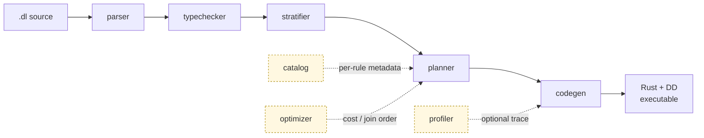

<p align="center">
  
</p>

<p align="center">
  <h3 align="center">A composable Datalog engine that compiles programs into efficient, scalable Differential Dataflow executables.</h3>
</p>

<p align="center">
  <a href="#tldr">TL;DR</a> •
  <a href="#quick-start">Quick Start</a> •
  <a href="ARCHITECTURE.md">Architecture</a> •
  <a href="#cli">CLI</a> •
  <a href="#tests">Tests</a> •
  <a href="https://www.vldb.org/pvldb/vol19/p361-zhao.pdf">Paper</a>
</p>

<p align="center">
  <a href="https://crates.io/crates/flowlog-build"></a>
  <a href="https://docs.rs/flowlog-build"></a>
  <a href="https://crates.io/crates/flowlog-runtime"></a>
  <a href="https://docs.rs/flowlog-runtime"></a>
  <a href="LICENSE"></a>
</p>

> **Status:** under active development; interfaces may change without notice.

## TL;DR

You write Datalog (`.dl`). FlowLog **compiles** it through a multi-stage pipeline (parse → type-check → stratify → plan → codegen) into a **standalone Rust executable** that runs on top of [Timely](https://github.com/TimelyDataflow/timely-dataflow) + [Differential Dataflow](https://github.com/TimelyDataflow/differential-dataflow). You get four execution modes out of the box:

|                | **Batch** (run-once) | **Incremental** (maintain) |
|----------------|----------------------|-----------------------------|
| **Datalog**    | `datalog-batch` *(default)* | `datalog-inc`               |
| **Extended**\* | `extend-batch`       | `extend-inc`                |

\* Extended adds explicit `loop { … }` / `fixpoint { … }` blocks for fine-grained control over recursion.

## Quick Start

```bash
# 1. install toolchain + helpers
bash tools/env/env.sh

# 2. build the workspace; the compiler binary lands at
#    target/release/flowlog-compiler
cargo build --release

# 3. compile and run the canonical reachability example
mkdir -p reach
printf '1\n'             > reach/Source.csv
printf '1,2\n2,3\n'      > reach/Arc.csv

target/release/flowlog-compiler example/graph_analysis/reach.dl \
    -F reach -o reach_bin -D -          # compile (-D - prints to stderr)
./reach_bin -w 4                        # run on 4 workers
```

That's it. The Datalog program itself ([`example/graph_analysis/reach.dl`](example/graph_analysis/reach.dl)):

```datalog
.decl Source(id: int32)
.input Source(IO="file", filename="Source.csv", delimiter=",")
.decl Arc(x: int32, y: int32)
.input Arc(IO="file", filename="Arc.csv", delimiter=",")

.decl Reach(id: int32)

Reach(y) :- Source(y).
Reach(y) :- Reach(x), Arc(x,y).

.printsize Reach
```

For incremental mode, profiler usage, and richer examples see <https://www.flowlog-rs.com/>.

## Architecture



The repository is a small Cargo workspace of three crates plus example programs and tests:

| Crate | Role |
|---|---|
| **`flowlog-build`** | The whole pipeline as a library — used from `build.rs` to bake a Datalog program into your Rust crate. Houses `parser`, `typechecker`, `catalog`, `stratifier`, `optimizer`, `planner`, `codegen`, and `profiler` as submodules. |
| **`flowlog-compiler`** | The standalone `flowlog-compiler` binary — calls into `flowlog-build`, then scaffolds and `cargo build`s a self-contained executable. |
| **`flowlog-runtime`** | Tiny runtime consumed by generated code: string interning, file IO sharding, sort/merge helpers, and incremental-transaction state. |

Each module under `flowlog-build/src/` has its own `README.md` describing purpose, design, and key types — start there when you need to understand or modify a stage. For the big-picture map of the whole pipeline (with hyperlinks to every per-module README and a stage-by-stage walkthrough), see [`ARCHITECTURE.md`](ARCHITECTURE.md).

## CLI

```bash
flowlog-compiler <PROGRAM> [OPTIONS]
```

| Flag | Required when… | What it does |
|---|---|---|
| `PROGRAM` | always | Path to a `.dl` file. Use `all` / `--all` to iterate over `example/`. |
| `-F, --fact-dir <DIR>` | `.input` uses relative filenames | Prepends `<DIR>` to each `filename=` parameter. |
| `-o <PATH>` | optional | Output executable path; defaults to the program stem (`reach.dl` → `./reach`). |
| `-D, --output-dir <DIR>` | any `.output` is used | Where to materialize output relations. Pass `-` to print tuples to stderr instead. |
| `--mode <MODE>` | optional | `datalog-batch` *(default)* \| `datalog-inc` \| `extend-batch` \| `extend-inc`. |
| `--sip` | optional | Enable Sideways Information Passing (push binding constraints into body atoms). |
| `--str-intern` | optional | Intern string columns at load time for faster joins / lower memory. |
| `-I, --include-dir <DIR>` | optional, repeatable | Extra search directory for `.include` directives. |
| `--udf-file <PATH>` | optional | Rust source defining UDFs declared via `.extern fn`. |
| `--save-temps` | optional | Keep the intermediate generated crate (otherwise removed after build). |
| `-P, --profile` | optional | Enable operator-level profiling (writes `<stem>_log/` next to the executable). |
| `-h, --help` | — | Print Clap-generated help. |

## Tests

End-to-end tests live in `tests/`. Two complementary suites:

| Path | Suite | Entry point |
|---|---|---|
| `tests/unit/datalog-batch/`<br/>`tests/unit/datalog-inc/`<br/>`tests/unit/extend-batch/` | Per-fixture programs run end-to-end. Three categories today (no `extend-inc` fixtures yet). | `tests/unit/unit_compiler.sh` (binary mode)<br/>`tests/unit/unit_lib.sh` (library mode) |
| `tests/complex/` | Larger programs diffed against a [Souffle](https://souffle-lang.github.io/) reference fetched from HuggingFace. | `tests/complex/datalog_batch_compiler.sh`<br/>`tests/complex/datalog_batch_lib.sh` |
| `tests/ldbc/` | LDBC SNB queries on canonical graph datasets. | `tests/ldbc/ldbc.sh` |

```bash
# unit-level — fast, runs every fixture for every mode in <category>:
bash tests/unit/unit_compiler.sh                  # binary-mode runner, all fixtures
bash tests/unit/unit_lib.sh agg_avg agg_count     # library-mode runner, named fixtures

# correctness vs Souffle — slow, requires network for first dataset fetch:
bash tests/complex/datalog_batch_compiler.sh
```

Each fixture is a directory with `program.dl`, optional `data/` (CSV facts), `expected/` (one file per `.output` relation), and an optional `commands.txt` (incremental transcripts) / `runtime_flags`.

## Background Reading

> **FlowLog: Efficient and Extensible Datalog via Incrementality**  \
> Hangdong Zhao, Zhenghong Yu, Srinag Rao, Simon Frisk, Zhiwei Fan, Paraschos Koutris  \
> VLDB 2026 (Boston) — [pVLDB](https://www.vldb.org/pvldb/vol19/p361-zhao.pdf) • [Artifacts](https://github.com/flowlog-rs/vldb26-artifact)

## Contributing

Issues and pull requests welcome. Before submitting, please run `cargo test` plus the unit-level suites (`bash tests/unit/unit_compiler.sh` and `bash tests/unit/unit_lib.sh`) and confirm both pass on your change.
