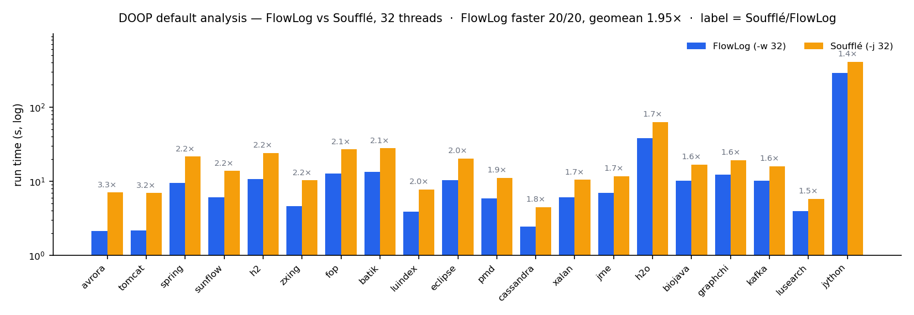
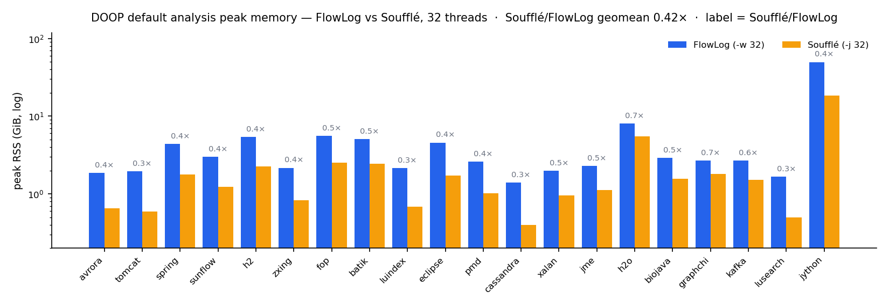

<p align="center">
  
</p>

<p align="center">
  <h3 align="center">Composable Datalog engine that compiles programs into efficient and scalable Differential Dataflow executables.</h3>
</p>

<p align="center">
  <a href="#quick-start">Quick&nbsp;Start</a> &nbsp;·&nbsp;
  <a href="#architecture">Architecture</a> &nbsp;·&nbsp;
  <a href="#compiler-cli">Compiler&nbsp;CLI</a> &nbsp;·&nbsp;
  <a href="https://www.vldb.org/pvldb/vol19/p361-zhao.pdf">Paper</a>
</p>

<p align="center">
  <a href="https://crates.io/crates/flowlog-build"></a>
  <a href="https://docs.rs/flowlog-build"></a>
  &nbsp;
  <a href="https://crates.io/crates/flowlog-runtime"></a>
  <a href="https://docs.rs/flowlog-runtime"></a>
  &nbsp;
  <a href="LICENSE"></a>
</p>

> **Status** · Under active development; interfaces may change without notice.

Built on [Timely](https://github.com/TimelyDataflow/timely-dataflow) and [Differential Dataflow](https://github.com/TimelyDataflow/differential-dataflow), FlowLog pairs batch Datalog with first-class **incremental maintenance** — outputs update without recomputation as facts change. On DOOP points-to it runs **~2× faster than Soufflé** across 20 DaCapo programs (32 threads), with identical results.

## Quick Start

**1 — Install the toolchain.** One-time setup — Rust (1.80+) and required OS packages, then a `cargo check` smoke test.

```bash
$ bash env/env.sh     # Linux / macOS
PS> .\env\env.ps1     # Windows (elevated PowerShell)
```

**2 — Build.** The compiler lands at `target/release/flowlog-compiler`.

```bash
$ cargo build --release
```

**3 — Run an example.** `example/graph_analysis/reach.dl` — nodes reachable from a seed set:

```datalog
.decl Source(id: int32)
.input Source(IO="file", filename="Source.csv", delimiter=",")
.decl Arc(x: int32, y: int32)
.input Arc(IO="file", filename="Arc.csv", delimiter=",")

.decl Reach(id: int32)
Reach(y) :- Source(y).
Reach(y) :- Reach(x), Arc(x,y).
.printsize Reach
```

Make a tiny dataset, then compile and run:

```bash
$ mkdir -p reach
$ printf '1\n'        > reach/Source.csv
$ printf '1,2\n2,3\n' > reach/Arc.csv

# Compile to a binary, then run it on 4 worker threads
$ target/release/flowlog-compiler example/graph_analysis/reach.dl -F reach -o reach_bin -D -
$ ./reach_bin -w 4
```

Flag reference: [Compiler CLI](#compiler-cli). For incremental mode and the profiler, see <https://www.flowlog-rs.com/>.

## Architecture

A `.dl` program compiles through five stages; three side modules assist the planner and codegen:

```text
                                                   profiler
                                                       ┊
                                                       ↓
.dl → parser → typechecker → stratifier → planner → codegen → executable
                                             ↑
                                             ┊
                                    catalog · optimizer
```

**Pipeline**

- **parser** — `.dl` → typed AST, each node source-located.
- **typechecker** — resolves literal types (`1` → `int32`).
- **stratifier** — groups rules into strata (one per `loop` / `fixpoint`) for ordered recursion.
- **planner** — lowers rules to a Differential Dataflow plan, sharing sub-plans to reuse arrangements.
- **codegen** — emits the plan as Timely + Differential Dataflow Rust.

**Side modules**

- **catalog** — per-rule metadata for the planner (signatures, pushdown filters, range checks).
- **optimizer** — cardinality-based join ordering and worst-case optimal joins (WIP).
- **profiler** — runtime metrics from Timely / Differential Dataflow operators.

**Crates**

- **`flowlog-build`** — library; compile `.dl` to Rust from `build.rs`.
- **`flowlog-compiler`** — CLI; compile `.dl` to a standalone executable.
- **`flowlog-runtime`** — linked into output (interning, IO, sort/merge, incremental-txn state); not a direct dep.

## Compiler CLI

```bash
$ flowlog-compiler <PROGRAM> [OPTIONS]
```

`<PROGRAM>` is a path to a `.dl` file, or `all` / `--all` to compile every program in `example/`. Common options:

- `-F, --fact-dir <DIR>` — prepend `<DIR>` to relative `filename=` paths in `.input` directives.
- `-o <PATH>` — output executable path; defaults to the program stem (`reach.dl` → `./reach`).
- `-D, --output-dir <DIR>` — where to materialize `.output` relations; `-` prints tuples to stderr.
- `--mode <MODE>` — `datalog-batch` (default), `datalog-inc`, `extend-batch`, or `extend-inc` (extended modes WIP).
- `--sip` — sideways information passing: filter later body atoms by earlier bindings to shrink joins (off by default).
- `--str-intern` — intern string columns at load for faster joins and lower memory (off by default).
- `-P, --profile` — collect execution statistics (Datalog modes only).
- `-h, --help` — full help text.

## Testing

A green oracle run is the definition of correct — see [`tests/README.md`](tests/README.md) for per-suite contracts and recipes.

### FlowLog vs Soufflé — DOOP points-to

Apple-to-apple on the DOOP **default** points-to analysis (`doop/default.dl`) across all 20 [DaCapo](https://www.dacapobench.org/) programs at **32 threads** (FlowLog `-w 32`, Soufflé `-j 32`). The Soufflé program is the same `default.dl` with only type-keyword renames (`:string`→`:symbol`, `:int32`→`:number`) — identical rules and join order. All 20 produce **identical VarPointsTo**.





- **Run time** (run only; one-off compile excluded) — FlowLog faster on **20/20**, geomean **1.95×** (range 1.41–3.27×).
- **Peak memory** — Soufflé is leaner: Soufflé/FlowLog geomean **0.42×** (FlowLog trades memory for speed).

Full methodology and numbers: [`flowlog-bench`](https://github.com/flowlog-rs/flowlog-bench).

## Publication

> **FlowLog: Efficient and Extensible Datalog via Incrementality**  
> Hangdong Zhao, Zhenghong Yu, Srinag Rao, Simon Frisk, Zhiwei Fan, Paraschos Koutris  
> VLDB 2026, Boston

- **Paper** — [PVLDB Vol. 19](https://www.vldb.org/pvldb/vol19/p361-zhao.pdf)
- **Artifacts** — [flowlog-rs/vldb26-artifact](https://github.com/flowlog-rs/vldb26-artifact)

## Contributing

Issues and pull requests are welcome. PRs must pass CI before merge.

**Let's make Datalog fast — and incremental.**
