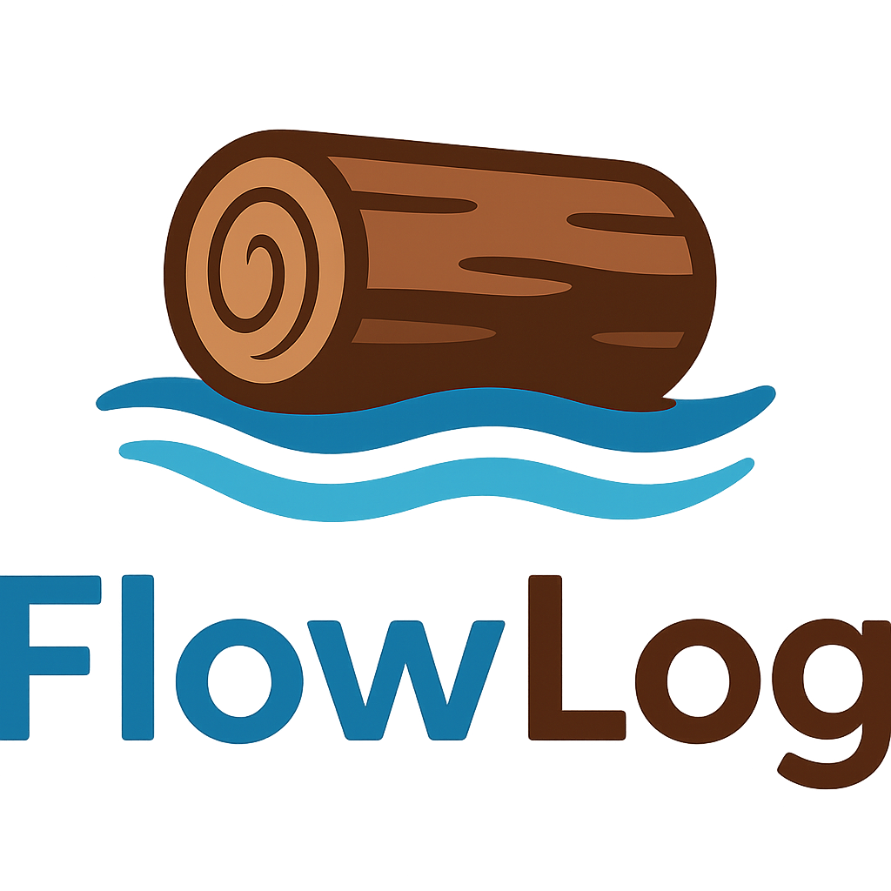

<p align="center">
  
</p>

<p align="center">
  <h3 align="center">Composable Datalog compiler that auto-generates efficient and scalable Differential Dataflow programs.</h3>
</p>

<p align="center">
  <a href="#end-to-end-example">Quick Start</a> •
  <a href="#architecture">Architecture</a> •
  <a href="#compiler-cli">Compiler CLI</a> •
  <a href="https://www.vldb.org/pvldb/vol19/p361-zhao.pdf">FlowLog Paper</a>
</p>

**Status:** FlowLog is under active development; interfaces may change without notice.

## Architecture

A `.dl` program flows through the following pipeline:

```
.dl source → parser → stratifier → planner → compiler → Cargo project
                                     ▲  ▲
                                catalog  optimizer
```

| Crate | Role |
|-------|------|
| `parser` | Pest grammar → AST |
| `stratifier` | Dependency analysis and SCC-based rule scheduling |
| `catalog` | Per-rule metadata used during planning |
| `optimizer` | Heuristic cost model for join ordering |
| `planner` | Lowers strata into dataflow transformation plans |
| `compiler` | Generates a Timely / Differential Dataflow Rust project |
| `common` | Shared CLI and utility helpers |
| `profiler` | Optional execution statistics |

## Getting Started

### Prerequisites

```bash
$ bash tools/env.sh
```

The bootstrap script installs a stable Rust toolchain and a few helper utilities. At a minimum you need `rustup`, `cargo`, and a compiler capable of building Timely/Differential (Rust 1.80+ recommended).

### Build the Workspace

```bash
$ cargo build --release
```

## Compiler CLI

Use the compiler to lower a FlowLog program into a Timely/Differential Cargo project.

```bash
$ cargo run -p compiler -- <PROGRAM> [OPTIONS]
```

| Flag | Description | Required | Notes |
|------|-------------|----------|-------|
| `PROGRAM` | Path to a `.dl` file. Accepts `all` or `--all` to iterate over every program in `example/`. | Yes | Parsed relative to the workspace unless absolute. |
| `-F, --fact-dir <DIR>` | Directory containing input CSVs referenced by `.input` directives. | When `.input` uses relative filenames | Prepends `<DIR>` to each `filename=` parameter; omit to use paths embedded in the program. |
| `-o, --output <NAME>` | Override the generated Cargo package name. | No | Default derives from `<PROGRAM>`; project is written to `../<NAME>`. |
| `-D, --output-dir <DIR>` | Location for materializing `.output` relations. | Required when any relation uses `.output` | Pass `-` to print tuples to stderr instead of writing files. |
| `--mode <MODE>` | Choose execution semantics: `datalog-batch` (default), `datalog-inc`, `extend-batch`, or `extend-inc`. | No | `datalog-batch` uses `Present` diff; all other modes use `i32`. Extended modes enable explicit `loop` blocks. |
| `-P, --profile` | Enable profiling (collect execution statistics). | No | Writes profiler logs into the generated project. |
| `-h, --help` | Show full Clap help text. | No | Includes additional examples and environment variables. |

## End-to-End Example

The `example/reach.dl` program computes nodes reachable from a small seed set. Below is the same program for reference.

> Note: The example commands below only show batch-mode parameters. For incremental mode and profiler usage, please refer to the official website: https://www.flowlog-rs.com/

```datalog
.decl Source(id: number)
.input Source(IO="file", filename="Source.csv", delimiter=",")

.decl Arc(x: number, y: number)
.input Arc(IO="file", filename="Arc.csv", delimiter=",")

.decl Reach(id: number)
.printsize Reach

Reach(y) :- Source(y).
Reach(y) :- Reach(x), Arc(x, y).
```

### 1. Generate the Executable

```bash
$ cargo run -p compiler -- example/reach.dl -F reach -o reach_flowlog -D -
```

Key flags:

- `-F reach` points the compiler at the directory holding `Source.csv` and `Arc.csv`.
- `-o reach_flowlog` names the generated Cargo project (written to `../reach_flowlog`).
- `-D -` prints IDB tuples and sizes to stderr; pass a directory path to materialize CSV output files instead.

### 2. Prepare a Tiny Dataset

```bash
$ cd reach_flowlog
$ mkdir -p reach
$ cat <<'EOF' > reach/Source.csv
  1
  EOF

$ cat <<'EOF' > reach/Arc.csv
  1,2
  2,3
  EOF
```

### 3. Build and Run the Generated Project

```bash
$ cargo run --release -- -w 4
```

## End-to-End Tests

End-to-end tests live in `tests/e2e/`. Run the full suite with:

```bash
$ bash tests/e2e/run.sh
```

Or run specific tests by name:

```bash
$ bash tests/e2e/run.sh loop_fixpoint negation
```

Each test is a directory under `tests/e2e/<test_name>/` containing:
- `program.dl` — Datalog source (must use `.output` directives).
- `data/` — Optional CSV input facts copied into the generated project.
- `expected/` — Expected output files (one per output relation).
- `commands.txt` — Optional incremental transcript (enables incremental mode).

## Background Reading

> **FlowLog: Efficient and Extensible Datalog via Incrementality**  \
> Hangdong Zhao, Zhenghong Yu, Srinag Rao, Simon Frisk, Zhiwei Fan, Paraschos Koutris  \
> VLDB 2026 (Boston) — [pVLDB](https://www.vldb.org/pvldb/vol19/p361-zhao.pdf) • [VLDB 2026 Artifacts](https://github.com/flowlog-rs/vldb26-artifact)

## Contributing

Contributions and bug reports are welcome. Please open an issue or submit a pull request once you have reproduced the change with `cargo test` and `bash tests/e2e/run.sh`.

