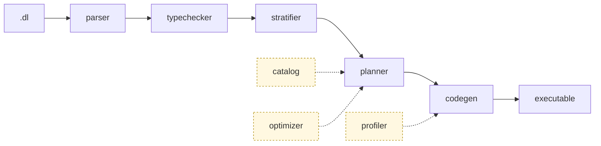

<p align="center">
  
</p>

<p align="center">
  <h3 align="center">Composable Datalog engine that compiles programs into efficient and scalable Differential Dataflow executables.</h3>
</p>

<p align="center">
  <a href="#end-to-end-example">Quick Start</a> •
  <a href="#architecture">Architecture</a> •
  <a href="#compiler-cli">Compiler CLI</a> •
  <a href="https://www.vldb.org/pvldb/vol19/p361-zhao.pdf">FlowLog Paper</a>
</p>

<p align="center">
  <a href="https://crates.io/crates/flowlog-build"></a>
  <a href="https://docs.rs/flowlog-build"></a>
  <a href="https://crates.io/crates/flowlog-runtime"></a>
  <a href="https://docs.rs/flowlog-runtime"></a>
  <a href="LICENSE"></a>
</p>

**Status:** FlowLog is under active development; interfaces may change without notice. `datalog-batch` and `datalog-inc` are the supported modes today; `extend-batch` and `extend-inc` (which add explicit `loop`/`fixpoint` blocks for recursion control) are work-in-progress and `--profile` is unsupported under either Extended sub-mode.

## Architecture

A `.dl` program flows through five sequential stages, supported by three side modules.



- **parser** — Pest grammar → typed AST anchored to source spans.
- **typechecker** — pins every polymorphic literal to a concrete width.
- **stratifier** — SCC analysis; each `loop`/`fixpoint` block is one recursive stratum.
- **planner** — per-rule `prepare → SIP → core → fuse → post`, dedup'd across rules so DD shares arrangements.
- **codegen** — Timely + Differential Dataflow operator chains as `proc_macro2::TokenStream`.

The **catalog** (built per-rule inside the planner) precomputes signatures, supersets, local filters, and enforces range-restriction. The **optimizer** stores EDB cardinalities for join ordering. The **profiler** (`-P`) lines build-time predictions up against Timely's runtime operator logs. A small **common** module supplies source spans, `Diagnostic`-trait errors, and `u64` fingerprints that thread `catalog → planner → codegen` to enable arrangement sharing.

Codegen output (`CodeParts`) is consumed by either of two frontends: **library mode** (`flowlog-build::compile()` from a `build.rs`) emits a single `.rs` to `$OUT_DIR/<stem>.rs`; **binary mode** (`flowlog-compiler` CLI) scaffolds a Cargo project, builds it, and drops a binary at `-o <PATH>`. Both link `flowlog-runtime` at run time for interning, IO, sort/merge, and incremental-txn state.

The workspace is split across three crates:

- **`flowlog-build`** — the compile pipeline as a library; houses `parser`, `typechecker`, `catalog`, `stratifier`, `optimizer`, `planner`, `codegen`, `profiler`, and the library-mode `build/` orchestrator.
- **`flowlog-compiler`** — the `flowlog-compiler` binary; calls `flowlog-build`, scaffolds + `cargo build`s a standalone executable.
- **`flowlog-runtime`** — tiny runtime consumed by generated code (interning, IO, sort, txn).

## Getting Started

### Prerequisites

```bash
$ bash tools/env/env.sh
```

The bootstrap script installs a stable Rust toolchain and a few helper utilities. At a minimum you need `rustup`, `cargo`, and a compiler capable of building Timely/Differential (Rust 1.80+ recommended).

### Build the Workspace

```bash
$ cargo build --release
```

The compiler binary lands at `target/release/flowlog-compiler`.

## Compiler CLI

Compile a FlowLog program into a Timely/Differential Dataflow executable.

```bash
$ flowlog-compiler <PROGRAM> [OPTIONS]
```

`<PROGRAM>` is a path to a `.dl` file (or `all` / `--all` to iterate over every program in `example/`). Optional flags:

- `-F, --fact-dir <DIR>` — prepend `<DIR>` to every `filename=` in `.input` directives. Required when `.input` uses relative filenames.
- `-o <PATH>` — output executable path; defaults to the program stem (e.g. `reach.dl` → `./reach`).
- `-D, --output-dir <DIR>` — where to materialize `.output` relations. Pass `-` to print tuples to stderr. Required when any relation uses `.output`.
- `--mode <MODE>` — `datalog-batch` (default; uses `Present` diff), `datalog-inc`, `extend-batch`, or `extend-inc`. Extended modes are WIP.
- `--sip` — Sideways Information Passing; push binding constraints into body atoms. Off by default.
- `--str-intern` — intern string columns at load for faster joins / lower memory. Off by default.
- `-P, --profile` — collect execution statistics. Datalog modes only (panics under Extended).
- `-h, --help` — full Clap help text.

## End-to-End Example

The `example/graph_analysis/reach.dl` program computes nodes reachable from a small seed set:

```datalog
.decl Source(id: int32)
.input Source(IO="file", filename="Source.csv", delimiter=",")
.decl Arc(x: int32, y: int32)
.input Arc(IO="file", filename="Arc.csv", delimiter=",")

.decl Reach(id: int32)
Reach(y) :- Source(y).
Reach(y) :- Reach(x), Arc(x,y).
.printsize Reach
```

> Below shows batch mode only. For incremental mode and profiler usage see <https://www.flowlog-rs.com/>.

### 1. Prepare a Tiny Dataset

```bash
$ mkdir -p reach
$ printf '1\n'        > reach/Source.csv
$ printf '1,2\n2,3\n' > reach/Arc.csv
```

### 2. Compile and Run

```bash
# Compile the .dl program into a binary executable
$ target/release/flowlog-compiler example/graph_analysis/reach.dl -F reach -o reach_bin -D -

# Run the generated executable
$ ./reach_bin -w 4
```

Key flags:

- `-F reach` points the compiler at the directory holding `Source.csv` and `Arc.csv`.
- `-o reach_bin` names the output executable.
- `-D -` prints IDB tuples and sizes to stderr; pass a directory path to materialize CSV output files instead.
- `-w 4` tells the generated executable to use 4 worker threads.

## Testing & Benchmarking

```bash
$ make smoke   # ~5 min — every suite, tiny subset
$ make sweep   # full regression sweep (hours)
$ make perf    # tools/benchmark/compare.sh — timings + peak RSS vs the interpreter
```

`make sweep` runs four gated suites — `cargo test`, `tests/unit/` (binary + library), `tests/complex/` (vs a [Souffle](https://souffle-lang.github.io/) oracle), and `tools/benchmark/compare.sh` — and writes a single `result/sweep/<ts>/diagnosis.txt`. See [`tests/README.md`](tests/README.md) for what each suite checks, costs, and a representative perf+memory snapshot.


## Background Reading

> **FlowLog: Efficient and Extensible Datalog via Incrementality**  \
> Hangdong Zhao, Zhenghong Yu, Srinag Rao, Simon Frisk, Zhiwei Fan, Paraschos Koutris  \
> VLDB 2026 (Boston) — [pVLDB](https://www.vldb.org/pvldb/vol19/p361-zhao.pdf) • [VLDB 2026 Artifacts](https://github.com/flowlog-rs/vldb26-artifact)

## Contributing

Contributions and bug reports are welcome. Please open an issue or submit a pull request once you have run the unit suites:

```bash
$ bash tests/unit/unit_compiler.sh
$ bash tests/unit/unit_lib.sh
```
