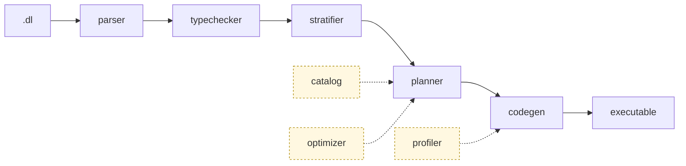

<p align="center">
  
</p>

<p align="center">
  <h3 align="center">Composable Datalog engine that compiles programs into efficient and scalable Differential Dataflow executables.</h3>
</p>

<p align="center">
  <a href="#end-to-end-example">Quick Start</a> •
  <a href="#architecture">Architecture</a> •
  <a href="#compiler-cli">Compiler CLI</a> •
  <a href="https://www.vldb.org/pvldb/vol19/p361-zhao.pdf">FlowLog Paper</a>
</p>

<p align="center">
  <a href="https://crates.io/crates/flowlog-build"></a>
  <a href="https://docs.rs/flowlog-build"></a>
  <a href="https://crates.io/crates/flowlog-runtime"></a>
  <a href="https://docs.rs/flowlog-runtime"></a>
  <a href="LICENSE"></a>
</p>

**Status:** FlowLog is under active development; interfaces may change without notice. 

## Architecture

A `.dl` program flows through five sequential stages, supported by side modules.



- **parser** — Reads `.dl` source into a typed AST, each node tagged with its source location.
- **typechecker** — Resolves every literal's type (e.g. `1` becomes `int32`).
- **stratifier** — Groups rules into evaluation strata (one per `loop`/`fixpoint` block) so recursion runs in the right order.
- **planner** — Lowers each rule to a Differential Dataflow plan; common sub-plans are shared across rules to reuse arrangements.
- **codegen** — Emits the plan as Rust code using Timely + Differential Dataflow.
- **catalog** — Caches per-rule metadata (relation signatures, pushdown filters, range-restriction checks) for the planner.
- **optimizer** — Picks join order based on cardinalities and worst-case optimal joins (WIP).
- **profiler** — Collects runtime metrics from Timely + Differential Dataflow operators.
- **common** — Small helpers shared across the rest of the pipeline.

The workspace is split across three crates:

- **`flowlog-build`** — Library form. Use from `build.rs` to compile `.dl` programs into Rust at build time.
- **`flowlog-compiler`** — CLI binary. Use to compile `.dl` programs into standalone executables.
- **`flowlog-runtime`** — Linked into the generated output for interning, IO, sort/merge, and incremental-txn state. Not depended on directly.

## Getting Started

### Prerequisites

```bash
$ bash env/env.sh     # Linux / macOS — one-time machine setup
PS> .\env\env.ps1     # or, on Windows (elevated PowerShell)
```

One-time machine setup: installs a stable Rust toolchain and the OS packages the build/tests need, then runs `cargo check --workspace` as a smoke test. Rust 1.80+ recommended.

### Build the Workspace

```bash
$ cargo build --release
```

The compiler binary lands at `target/release/flowlog-compiler`.

## Compiler CLI

Compile a FlowLog program into a Timely/Differential Dataflow executable.

```bash
$ flowlog-compiler <PROGRAM> [OPTIONS]
```

`<PROGRAM>` is a path to a `.dl` file (or `all` / `--all` to iterate over every program in `example/`). Optional flags:

- `-F, --fact-dir <DIR>` — prepend `<DIR>` to every `filename=` in `.input` directives. Required when `.input` uses relative filenames.
- `-o <PATH>` — output executable path; defaults to the program stem (e.g. `reach.dl` → `./reach`).
- `-D, --output-dir <DIR>` — where to materialize `.output` relations. Pass `-` to print tuples to stderr. Required when any relation uses `.output`.
- `--mode <MODE>` — `datalog-batch` (default; uses `Present` diff), `datalog-inc`, `extend-batch`, or `extend-inc`. Extended modes are WIP.
- `--sip` — Sideways Information Passing: filter later body atoms by bindings from earlier ones to shrink intermediate joins. Off by default.
- `--str-intern` — intern string columns at load for faster joins / lower memory. Off by default.
- `-P, --profile` — collect execution statistics. Datalog modes only; temporarily unsupported under Extended.
- `-h, --help` — full Clap help text.

## End-to-End Example

The `example/graph_analysis/reach.dl` program computes nodes reachable from a small seed set:

```datalog
.decl Source(id: int32)
.input Source(IO="file", filename="Source.csv", delimiter=",")
.decl Arc(x: int32, y: int32)
.input Arc(IO="file", filename="Arc.csv", delimiter=",")

.decl Reach(id: int32)
Reach(y) :- Source(y).
Reach(y) :- Reach(x), Arc(x,y).
.printsize Reach
```

> Below shows batch mode only. For incremental mode and profiler usage see <https://www.flowlog-rs.com/>.

### 1. Prepare a Tiny Dataset

```bash
$ mkdir -p reach
$ printf '1\n'        > reach/Source.csv
$ printf '1,2\n2,3\n' > reach/Arc.csv
```

### 2. Compile and Run

```bash
# Compile the .dl program into a binary executable
$ target/release/flowlog-compiler example/graph_analysis/reach.dl -F reach -o reach_bin -D -

# Run the generated executable
$ ./reach_bin -w 4
```

Key flags:

- `-F reach` points the compiler at the directory holding `Source.csv` and `Arc.csv`.
- `-o reach_bin` names the output executable.
- `-D -` prints IDB tuples and sizes to stderr; pass a directory path to materialize CSV output files instead.
- `-w 4` tells the generated executable to use 4 worker threads.

## Testing

See [`tests/README.md`](tests/README.md) for the per-suite contracts and recipes.

## Background Reading

> **FlowLog: Efficient and Extensible Datalog via Incrementality**  \
> Hangdong Zhao, Zhenghong Yu, Srinag Rao, Simon Frisk, Zhiwei Fan, Paraschos Koutris  \
> VLDB 2026 (Boston) — [pVLDB](https://www.vldb.org/pvldb/vol19/p361-zhao.pdf) • [VLDB 2026 Artifacts](https://github.com/flowlog-rs/vldb26-artifact)

## Contributing

Contributions and bug reports are welcome. Open an issue or submit a pull request — PRs must pass CI before merge.
