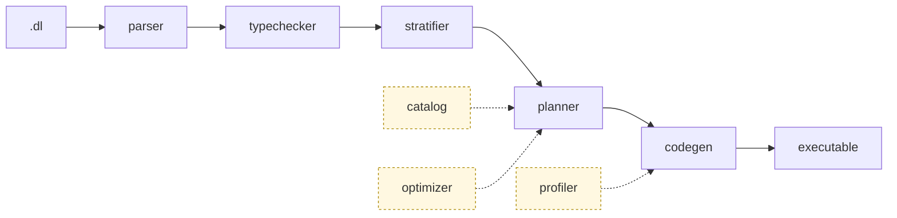

<p align="center">
  
</p>

<h3 align="center">A composable Datalog engine that compiles programs into efficient, scalable Differential&nbsp;Dataflow executables.</h3>

<p align="center">
  <a href="#what-is-it">What</a> •
  <a href="#quick-start">Quick&nbsp;Start</a> •
  <a href="#architecture">Architecture</a> •
  <a href="#cli">CLI</a> •
  <a href="#tests">Tests</a> •
  <a href="https://www.vldb.org/pvldb/vol19/p361-zhao.pdf">Paper</a>
</p>

<p align="center">
  <a href="https://crates.io/crates/flowlog-build"></a>
  <a href="https://docs.rs/flowlog-build"></a>
  <a href="https://crates.io/crates/flowlog-runtime"></a>
  <a href="https://docs.rs/flowlog-runtime"></a>
  <a href="LICENSE"></a>
</p>

## What is it

You write Datalog (`.dl`); FlowLog compiles it into a **standalone Rust executable** on top of [Timely](https://github.com/TimelyDataflow/timely-dataflow) + [Differential Dataflow](https://github.com/TimelyDataflow/differential-dataflow).

There are four execution modes, picked with `--mode`. Two are supported today: `datalog-batch` *(default)* runs the program once and returns the fixpoint, and `datalog-inc` maintains results across incremental updates. Two are still **work-in-progress**: `extend-batch` and `extend-inc` add explicit `loop { … }` / `fixpoint { … }` blocks for fine-grained control over recursion. The parser, planner and codegen accept the Extended syntax and `extend-batch` has six unit fixtures, but `extend-inc` has no test fixtures yet, and `--profile` panics under either Extended sub-mode.

## Quick start

```bash
bash tools/env/env.sh        # toolchain + helpers
cargo build --release        # builds target/release/flowlog-compiler

# canonical reachability example
mkdir -p reach
printf '1\n'        > reach/Source.csv
printf '1,2\n2,3\n' > reach/Arc.csv

target/release/flowlog-compiler example/graph_analysis/reach.dl \
    -F reach -o reach_bin -D -    # -D - prints to stderr
./reach_bin -w 4                  # 4 timely workers
```

The program ([`example/graph_analysis/reach.dl`](example/graph_analysis/reach.dl)):

```datalog
.decl Source(id: int32)
.input Source(IO="file", filename="Source.csv", delimiter=",")
.decl Arc(x: int32, y: int32)
.input Arc(IO="file", filename="Arc.csv", delimiter=",")

.decl Reach(id: int32)
Reach(y) :- Source(y).
Reach(y) :- Reach(x), Arc(x,y).
.printsize Reach
```

More examples and incremental usage: <https://www.flowlog-rs.com/>.

## Architecture

A `.dl` program flows through five sequential stages, with three support modules feeding into the planner and codegen:



### The five pipeline stages

The **parser** turns `.dl` source into a typed AST. It uses Pest as the grammar engine, resolves `.include` directives at the text level (so the parser itself never has to merge two parse trees), and produces a `Program` containing relation declarations, segments, UDFs and inline facts. Every AST node carries a `Span` so later stages can produce diagnostics that point at the user's source.

The **typechecker** runs in one pass over the AST. It rejects programs whose types don't line up (conflicting variable bindings, mixed-width arithmetic, head-vs-`.decl` mismatch, malformed UDF calls, aggregations over non-numeric inputs) and **pins** every polymorphic literal — `ConstType::Int(_)` and `ConstType::Float(_)` placeholders left by the parser — to the concrete width derived from its surrounding context. After it returns `Ok`, no polymorphic literal survives anywhere in the program, so every downstream stage can call `data_type()` unconditionally.

The **stratifier** decides the order in which rule groups must run so every rule's dependencies are computed before it fires. Each `Plain` segment of the program goes through a per-segment dependency graph, Tarjan's SCC algorithm, and a topological sort; each `loop` / `fixpoint` block becomes exactly one recursive stratum, regardless of how many rules it contains. In Extended mode, plain-rule recursion is rejected outright (`StratifyError::RecursionOutsideLoop`); in Datalog mode it's handled implicitly via SCC detection.

The **planner** is the largest module. For each rule it runs a five-phase pipeline — `prepare` (push down local filters, semi-joins, comparison sites), an optional `SIP` pass (push binding constraints from heads into bodies, when `--sip` is set), `core` (join two positive atoms then iterate semi-join + projection to a fixed point), `fuse` (merge KV-to-KV maps), and `post` (align the final pipeline output to the rule head). Then at the stratum level it deduplicates transformations across rules so DD can share arrangements, splits EDB-only work from IDB-dependent work, and records aggregation metadata for codegen.

The **codegen** stage takes the planner's output and emits Timely + Differential Dataflow operator chains as `proc_macro2::TokenStream` fragments bundled into a `CodeParts` struct. Per stratum it emits the non-recursive head first, then either a recursive block (`.iterate(...)` for batch, `Variable`-scoped for incremental) or the non-recursive post-flows. The bundle is intentionally flat so each frontend can pick the subset it needs.

### Support modules

Three modules feed in to the spine rather than sit on it. The **catalog** is built per rule **inside** the planner; it precomputes atom signatures, positive/negative variable maps, "supersets" (which positive atoms cover the variables of each comparison/UDF/predicate), and local filters. It's also the place where **range-restriction** is enforced: a variable in a negated atom, comparison or UDF call must be bound by some positive atom, otherwise `CatalogError::UnsafeVariable` fires. The **optimizer** stores per-relation cardinalities and emits a per-rule plan tree consulted during the planner's `core` phase; today it produces a left-deep chain in source order, with cost-based ordering as future work. The **profiler** is optional (`-P` / `--profile`) and records a static plan graph at compile time alongside Timely's runtime operator logs at run time, so each operator a tuple flows through can be attributed back to the FlowLog construct that emitted it. Profiling is **Datalog-modes-only** — combining `--profile` with `extend-batch` or `extend-inc` panics. A small **common** module supplies what every stage uses: `FileId` / `Span` / `SourceMap` for source anchoring, the `Diagnostic` trait + `BoxError` for error rendering, the `Config` struct, and a `compute_fp` helper for the `u64` fingerprints that thread through `catalog → planner → codegen` to enable arrangement sharing.

### Two output paths

After codegen there are two frontends that share the same `CodeParts`. **Library mode** lives in `crates/flowlog-build/src/build/`; it stitches the fragments into a single `.rs` file written to `$OUT_DIR/<stem>.rs`, which your crate `include!`s. It's driven from your `build.rs` via `flowlog_build::compile()`, exposes inherent methods on `{Name}Input` structs (no `Relation` trait at the user surface), and returns `BatchResults` or `IncrementalResults` from the engine call. **Binary mode** lives in `crates/flowlog-compiler/`; it scaffolds a complete Cargo project under a `.<stem>.build/` directory, runs `cargo build --release`, and copies the binary to `-o <PATH>`. It's the path the `flowlog-compiler` CLI takes; it uses a `Relation` trait + per-EDB `Rel{Name}` handlers, drives Timely from a generated `main.rs`, and writes output relations to files (or stderr with `-D -`).

The runtime crate `flowlog-runtime` supplies what generated code calls into: thread-safe string interning (`lasso::ThreadedRodeo`), file-IO sharding for parallel ingest, `k_way_merge` and `topk` for `ORDER BY` / `LIMIT` drains, and the `Transaction` state types used by incremental drivers.

### Workspace layout

```
flowlog/
├── crates/
│   ├── flowlog-build/         compile pipeline (library); used from build.rs
│   │   └── src/{parser, typechecker, stratifier, catalog, optimizer,
│   │              planner, codegen, build, profiler, common}/
│   ├── flowlog-compiler/      standalone CLI binary
│   └── flowlog-runtime/       runtime helpers consumed by generated code
├── example/                   .dl programs (graph_analysis, knowledge_reasoning,
│                              ldbc_snb, program_analysis, extended)
└── tests/                     unit / complex / ldbc end-to-end suites
```

## CLI

```bash
flowlog-compiler <PROGRAM> [OPTIONS]
```

| Flag | What it does |
|---|---|
| `PROGRAM` | Path to a `.dl` file. `all` / `--all` iterates over `example/`. |
| `-F, --fact-dir <DIR>` | Prepended to each `.input` `filename=`. |
| `-o <PATH>` | Output executable path. Default: program stem (`reach.dl` → `./reach`). |
| `-D, --output-dir <DIR>` | Where to materialize `.output` relations. Pass `-` for stderr. |
| `--mode <MODE>` | `datalog-batch` *(default)* · `datalog-inc` · `extend-batch` · `extend-inc`. |
| `--sip` | Sideways Information Passing — push binding constraints into body atoms. |
| `--str-intern` | Intern string columns at load time for faster joins / lower memory. |
| `-I, --include-dir <DIR>` | Extra search directory for `.include` (repeatable). |
| `--udf-file <PATH>` | Rust source defining UDFs declared via `.extern fn`. |
| `--save-temps` | Keep the intermediate generated crate. |
| `-P, --profile` | Operator-level profiling. **Datalog modes only — panics under Extended.** |
| `-h, --help` | Print Clap-generated help. |

## Tests

End-to-end tests live in `tests/`, in three suites of increasing depth.

`tests/unit/` is the inner-loop check: per-fixture programs run end-to-end and the output is diffed against `expected/`. It covers `datalog-batch`, `datalog-inc` and `extend-batch` (no `extend-inc` fixtures yet), and is invoked through `tests/unit/unit_compiler.sh` for the binary path or `tests/unit/unit_lib.sh` for the library path. Each runner accepts named fixtures or runs every fixture when called without arguments.

`tests/complex/` runs larger programs and diffs the output against a [Souffle](https://souffle-lang.github.io/) reference fetched from HuggingFace — slow (several minutes per dataset, network on first run) and `datalog-batch`-only today, invoked via `tests/complex/datalog_batch_compiler.sh` or `tests/complex/datalog_batch_lib.sh`.

`tests/ldbc/` runs LDBC SNB queries on canonical graph datasets via `tests/ldbc/ldbc.sh`, also `datalog-batch`-only.

```bash
bash tests/unit/unit_compiler.sh                # every fixture, binary mode
bash tests/unit/unit_lib.sh agg_avg agg_count   # named fixtures, library mode
bash tests/complex/datalog_batch_compiler.sh    # full Souffle correctness sweep
```

A fixture is a directory with `program.dl`, optional `data/` (CSVs), `expected/` (one file per `.output`), plus optional `commands.txt` (incremental transcripts) / `runtime_flags`.

## Background reading

> **FlowLog: Efficient and Extensible Datalog via Incrementality** \
> Hangdong Zhao, Zhenghong Yu, Srinag Rao, Simon Frisk, Zhiwei Fan, Paraschos Koutris \
> VLDB 2026 — [pVLDB](https://www.vldb.org/pvldb/vol19/p361-zhao.pdf) · [artifacts](https://github.com/flowlog-rs/vldb26-artifact)

## Contributing

Issues and PRs welcome. Before submitting, run the unit suites:

```bash
bash tests/unit/unit_compiler.sh
bash tests/unit/unit_lib.sh
```
