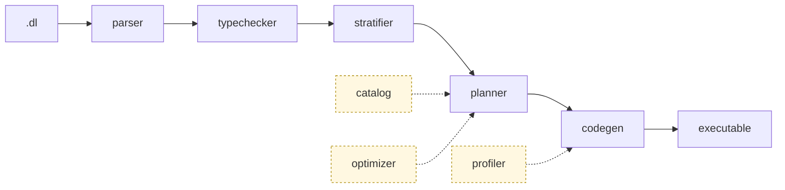

<p align="center">
  
</p>

<h3 align="center">A composable Datalog engine that compiles programs into efficient, scalable Differential&nbsp;Dataflow executables.</h3>

<p align="center">
  <a href="#quick-start">Quick&nbsp;Start</a> •
  <a href="ARCHITECTURE.md">Architecture</a> •
  <a href="#cli">CLI</a> •
  <a href="#tests">Tests</a> •
  <a href="https://www.vldb.org/pvldb/vol19/p361-zhao.pdf">Paper</a>
</p>

<p align="center">
  <a href="https://crates.io/crates/flowlog-build"></a>
  <a href="https://docs.rs/flowlog-build"></a>
  <a href="https://crates.io/crates/flowlog-runtime"></a>
  <a href="https://docs.rs/flowlog-runtime"></a>
  <a href="LICENSE"></a>
</p>

## What is it

You write Datalog (`.dl`); FlowLog compiles it into a standalone Rust executable on top of [Timely](https://github.com/TimelyDataflow/timely-dataflow) + [Differential Dataflow](https://github.com/TimelyDataflow/differential-dataflow).

|              | Batch *(run once)*           | Incremental *(maintain)*       |
|--------------|------------------------------|--------------------------------|
| **Datalog**  | `datalog-batch` *(default)* ✅ | `datalog-inc` ✅                |
| **Extended** | `extend-batch` 🚧             | `extend-inc` 🚧                 |

✅ supported · 🚧 work-in-progress (extended modes accept the syntax but `extend-inc` has no test fixtures yet, and `--profile` panics under either extended sub-mode).

## Quick start

```bash
bash tools/env/env.sh        # toolchain + helpers
cargo build --release        # builds target/release/flowlog-compiler

# canonical reachability example
mkdir -p reach
printf '1\n'        > reach/Source.csv
printf '1,2\n2,3\n' > reach/Arc.csv

target/release/flowlog-compiler example/graph_analysis/reach.dl \
    -F reach -o reach_bin -D -    # -D - prints to stderr
./reach_bin -w 4                  # 4 timely workers
```

The program ([`example/graph_analysis/reach.dl`](example/graph_analysis/reach.dl)):

```datalog
.decl Source(id: int32)
.input Source(IO="file", filename="Source.csv", delimiter=",")
.decl Arc(x: int32, y: int32)
.input Arc(IO="file", filename="Arc.csv", delimiter=",")

.decl Reach(id: int32)
Reach(y) :- Source(y).
Reach(y) :- Reach(x), Arc(x,y).
.printsize Reach
```

More examples and incremental usage: <https://www.flowlog-rs.com/>.

## Architecture



Three crates make up the workspace:

| Crate | Role |
|---|---|
| `flowlog-build` | The whole compile pipeline as a library; used from `build.rs`. |
| `flowlog-compiler` | The standalone `flowlog-compiler` CLI; scaffolds and `cargo build`s a binary. |
| `flowlog-runtime` | Tiny runtime called by generated code (interning, IO, sort, txn). |

Each module under `crates/flowlog-build/src/` has its own README. For the full pipeline walkthrough with hyperlinks, see [`ARCHITECTURE.md`](ARCHITECTURE.md).

## CLI

```bash
flowlog-compiler <PROGRAM> [OPTIONS]
```

| Flag | What it does |
|---|---|
| `PROGRAM` | Path to a `.dl` file. `all` / `--all` iterates over `example/`. |
| `-F, --fact-dir <DIR>` | Prepended to each `.input` `filename=`. |
| `-o <PATH>` | Output executable path. Default: program stem (`reach.dl` → `./reach`). |
| `-D, --output-dir <DIR>` | Where to materialize `.output` relations. Pass `-` for stderr. |
| `--mode <MODE>` | `datalog-batch` *(default)* · `datalog-inc` · `extend-batch` · `extend-inc`. |
| `--sip` | Sideways Information Passing: push binding constraints into body atoms. |
| `--str-intern` | Intern string columns at load for faster joins / lower memory. |
| `-I, --include-dir <DIR>` | Extra search dir for `.include` (repeatable). |
| `--udf-file <PATH>` | Rust source defining UDFs declared via `.extern fn`. |
| `--save-temps` | Keep the intermediate generated crate. |
| `-P, --profile` | Operator-level profiling. **Datalog modes only — panics under extended.** |
| `-h, --help` | Print Clap-generated help. |

## Tests

| Suite | Coverage | Runner |
|---|---|---|
| `tests/unit/` — fast end-to-end fixtures | `datalog-batch`, `datalog-inc`, `extend-batch` | `unit_compiler.sh` (binary), `unit_lib.sh` (library) |
| `tests/complex/` — diff against [Souffle](https://souffle-lang.github.io/) reference (network on first run) | `datalog-batch` | `datalog_batch_compiler.sh`, `datalog_batch_lib.sh` |
| `tests/ldbc/` — LDBC SNB queries | `datalog-batch` | `ldbc.sh` |

```bash
bash tests/unit/unit_compiler.sh                # run every fixture (binary mode)
bash tests/unit/unit_lib.sh agg_avg agg_count   # run named fixtures (library mode)
bash tests/complex/datalog_batch_compiler.sh    # full Souffle correctness sweep
```

A fixture is a directory with `program.dl`, optional `data/` (CSVs), `expected/` (one file per `.output`), plus optional `commands.txt` / `runtime_flags`.

## Background reading

> **FlowLog: Efficient and Extensible Datalog via Incrementality** \
> Hangdong Zhao, Zhenghong Yu, Srinag Rao, Simon Frisk, Zhiwei Fan, Paraschos Koutris \
> VLDB 2026 — [pVLDB](https://www.vldb.org/pvldb/vol19/p361-zhao.pdf) · [artifacts](https://github.com/flowlog-rs/vldb26-artifact)

## Contributing

Issues and PRs welcome. Before submitting, run the unit suites:

```bash
bash tests/unit/unit_compiler.sh
bash tests/unit/unit_lib.sh
```
