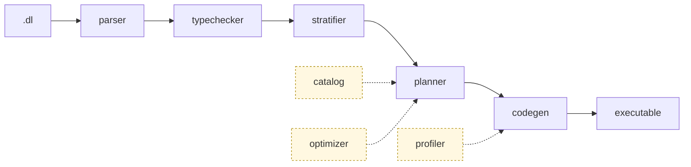

<p align="center">
  
</p>

<p align="center">
  <h3 align="center">Composable Datalog engine that compiles programs into efficient and scalable Differential Dataflow executables.</h3>
</p>

<p align="center">
  <a href="#end-to-end-example">Quick Start</a> •
  <a href="#architecture">Architecture</a> •
  <a href="#compiler-cli">Compiler CLI</a> •
  <a href="https://www.vldb.org/pvldb/vol19/p361-zhao.pdf">FlowLog Paper</a>
</p>

<p align="center">
  <a href="https://crates.io/crates/flowlog-build"></a>
  <a href="https://docs.rs/flowlog-build"></a>
  <a href="https://crates.io/crates/flowlog-runtime"></a>
  <a href="https://docs.rs/flowlog-runtime"></a>
  <a href="LICENSE"></a>
</p>

**Status:** FlowLog is under active development; interfaces may change without notice. `datalog-batch` and `datalog-inc` are the supported modes today; `extend-batch` and `extend-inc` (which add explicit `loop`/`fixpoint` blocks for recursion control) are work-in-progress and `--profile` is unsupported under either Extended sub-mode.

## Architecture

A `.dl` program flows through five sequential stages, with three support modules that feed into the planner and codegen:



The **parser** (Pest grammar) turns `.dl` source into a typed AST anchored to source spans. The **typechecker** rejects ill-typed programs and pins every polymorphic literal to a concrete width, so downstream stages can always call `data_type()` unconditionally. The **stratifier** groups rules into strata via SCC analysis; each `loop`/`fixpoint` block becomes one recursive stratum, and Extended-mode programs reject plain-rule recursion outright. The **planner** runs a per-rule pipeline (`prepare → SIP → core → fuse → post`) that lowers each rule into a sequence of `Transformation` operators, then deduplicates them across rules so DD can share arrangements. The **codegen** stage turns those transformations into Timely + Differential Dataflow operator chains as `proc_macro2::TokenStream` fragments bundled in a `CodeParts` struct.

The support modules sit alongside the spine: the **catalog** is built per-rule **inside** the planner and precomputes signatures, supersets, and local filters (it's also where range-restriction is enforced); the **optimizer** stores EDB cardinalities and is consulted by the planner's core phase for join order (today: left-deep, source order); and the **profiler** is optional (`-P`) and lines up build-time predictions with Timely's runtime operator logs. A small **common** module supplies what every stage uses: source spans, `Diagnostic`-trait error rendering, the `Config` struct, and `u64` fingerprints that thread through `catalog → planner → codegen` to enable arrangement sharing.

After codegen, the same `CodeParts` is consumed by either of two frontends. **Library mode** (`crates/flowlog-build/src/build/`) stitches the fragments into a single `.rs` file at `$OUT_DIR/<stem>.rs` for your crate to `include!`; it's driven from your `build.rs` via `flowlog_build::compile()`. **Binary mode** (`crates/flowlog-compiler/`) scaffolds a Cargo project, runs `cargo build --release`, and copies the binary to your `-o <PATH>`; it's the path the `flowlog-compiler` CLI takes. Both call into the small `flowlog-runtime` crate at run time for thread-safe interning, file-IO sharding, sort/merge helpers, and incremental-transaction state.

| Crate | Role |
|-------|------|
| `flowlog-build` | The whole compile pipeline as a library, used from `build.rs`. Houses `parser`, `typechecker`, `catalog`, `stratifier`, `optimizer`, `planner`, `codegen`, `profiler`, and the library-mode `build/` orchestrator. |
| `flowlog-compiler` | The standalone `flowlog-compiler` binary; calls into `flowlog-build`, then scaffolds and `cargo build`s a self-contained executable. |
| `flowlog-runtime` | Tiny runtime consumed by generated code (interning, IO, sort, txn). |

## Getting Started

### Prerequisites

```bash
$ bash tools/env/env.sh
```

The bootstrap script installs a stable Rust toolchain and a few helper utilities. At a minimum you need `rustup`, `cargo`, and a compiler capable of building Timely/Differential (Rust 1.80+ recommended).

### Build the Workspace

```bash
$ cargo build --release
```

The compiler binary lands at `target/release/flowlog-compiler`.

## Compiler CLI

Compile a FlowLog program into a Timely/Differential Dataflow executable.

```bash
$ flowlog-compiler <PROGRAM> [OPTIONS]
```

| Flag | Description | Required | Notes |
|------|-------------|----------|-------|
| `PROGRAM` | Path to a `.dl` file. Accepts `all` or `--all` to iterate over every program in `example/`. | Yes | Parsed relative to the workspace unless absolute. |
| `-F, --fact-dir <DIR>` | Directory containing input CSVs referenced by `.input` directives. | When `.input` uses relative filenames | Prepends `<DIR>` to each `filename=` parameter; omit to use paths embedded in the program. |
| `-o <PATH>` | Path for the generated executable. | No | Defaults to the program stem (e.g., `reach.dl` → `./reach`). |
| `-D, --output-dir <DIR>` | Location for materializing `.output` relations. | Required when any relation uses `.output` | Pass `-` to print tuples to stderr instead of writing files. |
| `--mode <MODE>` | Choose execution semantics: `datalog-batch` (default), `datalog-inc`, `extend-batch`, or `extend-inc`. | No | `datalog-batch` uses `Present` diff; all other modes use `i32`. Extended modes are WIP. |
| `--sip` | Sideways Information Passing — push binding constraints into body atoms. | No | Off by default. |
| `--str-intern` | Intern string columns at load for faster joins / lower memory. | No | Off by default. |
| `-P, --profile` | Enable profiling (collect execution statistics). | No | Datalog modes only — panics under Extended. |
| `-h, --help` | Show full Clap help text. | No | |

## End-to-End Example

The `example/graph_analysis/reach.dl` program computes nodes reachable from a small seed set:

```datalog
.decl Source(id: int32)
.input Source(IO="file", filename="Source.csv", delimiter=",")
.decl Arc(x: int32, y: int32)
.input Arc(IO="file", filename="Arc.csv", delimiter=",")

.decl Reach(id: int32)
Reach(y) :- Source(y).
Reach(y) :- Reach(x), Arc(x,y).
.printsize Reach
```

> Below shows batch mode only. For incremental mode and profiler usage see <https://www.flowlog-rs.com/>.

### 1. Prepare a Tiny Dataset

```bash
$ mkdir -p reach
$ printf '1\n'        > reach/Source.csv
$ printf '1,2\n2,3\n' > reach/Arc.csv
```

### 2. Compile and Run

```bash
# Compile the .dl program into a binary executable
$ target/release/flowlog-compiler example/graph_analysis/reach.dl -F reach -o reach_bin -D -

# Run the generated executable
$ ./reach_bin -w 4
```

Key flags:

- `-F reach` points the compiler at the directory holding `Source.csv` and `Arc.csv`.
- `-o reach_bin` names the output executable.
- `-D -` prints IDB tuples and sizes to stderr; pass a directory path to materialize CSV output files instead.
- `-w 4` tells the generated executable to use 4 worker threads.

## End-to-End Tests

End-to-end tests live in `tests/`, in three suites of increasing depth:

- `tests/unit/` — fast per-fixture runs, output diffed against `expected/`. Categories: `datalog-batch`, `datalog-inc`, `extend-batch` (no `extend-inc` fixtures yet). Invoked via `tests/unit/unit_compiler.sh` (binary path) or `tests/unit/unit_lib.sh` (library path).
- `tests/complex/` — larger programs diffed against a [Souffle](https://souffle-lang.github.io/) reference fetched from HuggingFace. `datalog-batch` only. Invoked via `tests/complex/datalog_batch_{compiler,lib}.sh`.
- `tests/ldbc/` — LDBC SNB queries on canonical graph datasets. `datalog-batch` only. Invoked via `tests/ldbc/ldbc.sh`.

```bash
$ bash tests/unit/unit_compiler.sh                 # every fixture, binary mode
$ bash tests/unit/unit_lib.sh agg_avg agg_count    # named fixtures, library mode
```

Each fixture is a directory with `program.dl`, optional `data/` (CSV facts), `expected/` (one file per `.output` relation), plus optional `commands.txt` (incremental transcripts) / `runtime_flags`.

## Background Reading

> **FlowLog: Efficient and Extensible Datalog via Incrementality**  \
> Hangdong Zhao, Zhenghong Yu, Srinag Rao, Simon Frisk, Zhiwei Fan, Paraschos Koutris  \
> VLDB 2026 (Boston) — [pVLDB](https://www.vldb.org/pvldb/vol19/p361-zhao.pdf) • [VLDB 2026 Artifacts](https://github.com/flowlog-rs/vldb26-artifact)

## Contributing

Contributions and bug reports are welcome. Please open an issue or submit a pull request once you have run the unit suites:

```bash
$ bash tests/unit/unit_compiler.sh
$ bash tests/unit/unit_lib.sh
```
