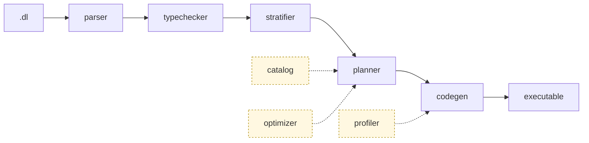

<p align="center">
  
</p>

<p align="center">
  <h3 align="center">Composable Datalog engine that compiles programs into efficient and scalable Differential Dataflow executables.</h3>
</p>

<p align="center">
  <a href="#end-to-end-example">Quick Start</a> •
  <a href="#architecture">Architecture</a> •
  <a href="#compiler-cli">Compiler CLI</a> •
  <a href="https://www.vldb.org/pvldb/vol19/p361-zhao.pdf">FlowLog Paper</a>
</p>

<p align="center">
  <a href="https://crates.io/crates/flowlog-build"></a>
  <a href="https://docs.rs/flowlog-build"></a>
  <a href="https://crates.io/crates/flowlog-runtime"></a>
  <a href="https://docs.rs/flowlog-runtime"></a>
  <a href="LICENSE"></a>
</p>

**Status:** Under active development; interfaces may change without notice.

## Architecture

A `.dl` program flows through five sequential stages (solid arrows), assisted by side modules (dashed).



**Stages:**

- **parser** — `.dl` source → typed AST, each node tagged with its source location.
- **typechecker** — resolves each literal's type (`1` → `int32`).
- **stratifier** — groups rules into strata (one per `loop`/`fixpoint`) so recursion runs in order.
- **planner** — lowers each rule to a Differential Dataflow plan, sharing common sub-plans to reuse arrangements.
- **codegen** — emits the plan as Timely + Differential Dataflow Rust.

**Side modules:**

- **catalog** — per-rule metadata (signatures, pushdown filters, range checks) for the planner.
- **optimizer** — cardinality-based join ordering and worst-case optimal joins (WIP).
- **profiler** — runtime metrics from Timely / Differential Dataflow operators.

Three crates make up the workspace:

- **`flowlog-build`** — library; call from `build.rs` to compile `.dl` to Rust at build time.
- **`flowlog-compiler`** — CLI; compile `.dl` into a standalone executable.
- **`flowlog-runtime`** — linked into generated output (interning, IO, sort/merge, incremental-txn state); not a direct dependency.

## Getting Started

### Prerequisites

```bash
$ bash env/env.sh     # Linux / macOS — one-time machine setup
PS> .\env\env.ps1     # or, on Windows (elevated PowerShell)
```

One-time setup: installs a stable Rust toolchain (1.80+) and the required OS packages, then runs `cargo check --workspace` as a smoke test.

### Build the Workspace

```bash
$ cargo build --release
```

The compiler binary lands at `target/release/flowlog-compiler`.

## Compiler CLI

Compile a FlowLog program into a Timely/Differential Dataflow executable.

```bash
$ flowlog-compiler <PROGRAM> [OPTIONS]
```

`<PROGRAM>` is a path to a `.dl` file, or `all` / `--all` to compile every program in `example/`. Common options:

- `-F, --fact-dir <DIR>` — prepend `<DIR>` to relative `filename=` paths in `.input` directives.
- `-o <PATH>` — output executable path; defaults to the program stem (`reach.dl` → `./reach`).
- `-D, --output-dir <DIR>` — where to materialize `.output` relations; `-` prints tuples to stderr.
- `--mode <MODE>` — `datalog-batch` (default), `datalog-inc`, `extend-batch`, or `extend-inc` (extended modes WIP).
- `--sip` — sideways information passing: filter later body atoms by earlier bindings to shrink joins (off by default).
- `--str-intern` — intern string columns at load for faster joins and lower memory (off by default).
- `-P, --profile` — collect execution statistics (Datalog modes only).
- `-h, --help` — full help text.

## End-to-End Example

The `example/graph_analysis/reach.dl` program computes nodes reachable from a small seed set:

```datalog
.decl Source(id: int32)
.input Source(IO="file", filename="Source.csv", delimiter=",")
.decl Arc(x: int32, y: int32)
.input Arc(IO="file", filename="Arc.csv", delimiter=",")

.decl Reach(id: int32)
Reach(y) :- Source(y).
Reach(y) :- Reach(x), Arc(x,y).
.printsize Reach
```

> Batch mode is shown here; for incremental mode and the profiler, see <https://www.flowlog-rs.com/>.

### 1. Prepare a Tiny Dataset

```bash
$ mkdir -p reach
$ printf '1\n'        > reach/Source.csv
$ printf '1,2\n2,3\n' > reach/Arc.csv
```

### 2. Compile and Run

```bash
# Compile the .dl program to a binary (compiler flags are listed above)
$ target/release/flowlog-compiler example/graph_analysis/reach.dl -F reach -o reach_bin -D -

# Run it on 4 worker threads
$ ./reach_bin -w 4
```

## Testing

See [`tests/README.md`](tests/README.md) for per-suite contracts and recipes.

## Background Reading

> **FlowLog: Efficient and Extensible Datalog via Incrementality**  \
> Hangdong Zhao, Zhenghong Yu, Srinag Rao, Simon Frisk, Zhiwei Fan, Paraschos Koutris  \
> VLDB 2026 (Boston) — [pVLDB](https://www.vldb.org/pvldb/vol19/p361-zhao.pdf) • [VLDB 2026 Artifacts](https://github.com/flowlog-rs/vldb26-artifact)

## Contributing

Issues and pull requests are welcome. PRs must pass CI before merge.
