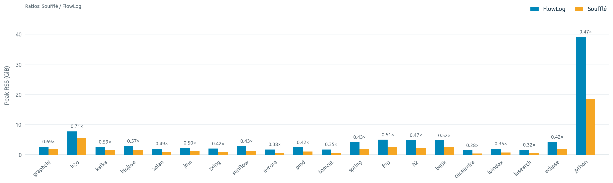

<p align="center">
  
</p>


<p align="center">
  <a href="https://crates.io/crates/flowlog-build"></a>
  <a href="https://docs.rs/flowlog-build"></a>
  &nbsp;
  <a href="https://crates.io/crates/flowlog-runtime"></a>
  <a href="https://docs.rs/flowlog-runtime"></a>
  &nbsp;
  <a href="LICENSE"></a>
</p>

> **status** · under active development; interfaces may change.

FlowLog compiles Datalog into efficient and scalable [Differential Dataflow](https://github.com/TimelyDataflow/differential-dataflow) rust executables.</h3> As such, FlowLog has first-class **incremental maintenance** — outputs update without recomputation as facts change. On DOOP points-to, [batch execution is **3.68× faster than Soufflé**](#benchmarks) across 20 DaCapo datasets (geometric mean, 32 threads).

## Quick Start

**1 — Install the toolchain.** One-time setup — Rust (1.80+) and required OS packages, then a `cargo check` smoke test.

```bash
$ bash env/env.sh     # Linux / macOS
PS> .\env\env.ps1     # Windows (elevated PowerShell)
```

**2 — Build.** The compiler lands at `target/release/flowlog-compiler`.

```bash
$ cargo build --release
```

**3 — Run an example.** `example/graph_analysis/reach.dl` — nodes reachable from a seed set:

```datalog
.decl Source(id: int32)
.input Source(IO="file", filename="Source.csv", delimiter=",")
.decl Arc(x: int32, y: int32)
.input Arc(IO="file", filename="Arc.csv", delimiter=",")

.decl Reach(id: int32)
Reach(y) :- Source(y).
Reach(y) :- Reach(x), Arc(x,y).
.printsize Reach
```

Make a tiny dataset, then compile and run:

```bash
$ mkdir -p reach
$ printf '1\n'        > reach/Source.csv
$ printf '1,2\n2,3\n' > reach/Arc.csv

# Compile to a binary, then run it on 4 worker threads
$ target/release/flowlog-compiler example/graph_analysis/reach.dl -F reach -o reach_bin -D -
$ ./reach_bin -w 4
```

Flag reference: [Compiler CLI](#compiler-cli). For incremental mode and the profiler, see <https://www.flowlog-rs.com/>.

## System requirements

FlowLog's performance and stability depend on a number of host and OS-level
settings. For example, on Linux a large analysis can abort with `memory
allocation of <N> bytes failed` even when memory is plentiful, because the
allocator maps many memory regions and exhausts a low
`vm.max_map_count`. Raising it resolves this:

```console
$ sudo sysctl -w vm.max_map_count=1048576
```

Before running, review the recommended host configuration in the setup guide:
<https://www.flowlog-rs.com/tutorial/getting-started/system-config>.

## Architecture

A `.dl` program compiles through five stages; three side modules assist the planner and codegen:

```text
                                                   profiler
                                                       ┊
                                                       ↓
.dl → parser → typechecker → stratifier → planner → codegen → executable
                                             ↑
                                             ┊
                                    catalog · optimizer
```

**Pipeline**

- **parser** — `.dl` → typed AST, each node source-located.
- **typechecker** — resolves literal types (`1` → `int32`).
- **stratifier** — groups rules into dependency-ordered strata; a stratum with a cycle recurses to fixpoint.
- **planner** — lowers rules to a Differential Dataflow plan, sharing sub-plans to reuse arrangements.
- **codegen** — emits the plan as Timely + Differential Dataflow Rust.

**Side modules**

- **catalog** — per-rule metadata for the planner (signatures, pushdown filters, range checks).
- **optimizer** — cardinality-based join ordering and worst-case optimal joins (WIP).
- **profiler** — runtime metrics from Timely / Differential Dataflow operators.

**Crates**

- **`flowlog-build`** — library; compile `.dl` to Rust from `build.rs`.
- **`flowlog-compiler`** — CLI; compile `.dl` to a standalone executable.
- **`flowlog-runtime`** — linked into output (interning, IO, sort/merge, incremental-txn state); not a direct dep.

## Compiler CLI

```bash
$ flowlog-compiler <PROGRAM> [OPTIONS]
```

`<PROGRAM>` is a path to a `.dl` file, or `all` / `--all` to compile every program in `example/`. Common options:

- `-F, --fact-dir <DIR>` — default directory for relative `.input` filenames; the executable can override it at runtime.
- `-o <PATH>` — output executable path; defaults to the program stem (`reach.dl` → `./reach`).
- `-D, --output-dir <DIR>` — default directory for `.output` files; `-` prints tuples to stdout. The executable can override it at runtime.
- `-B, --build-dir <DIR>` — keep the generated Rust project in this directory for subsequent builds.
- `-T, --target-dir <DIR>` — share Cargo artifacts across build directories; overrides `CARGO_TARGET_DIR`. Relative paths start at the compiler's working directory.
- `--mode <MODE>` — `batch` (default) or `inc`.
- `--str-intern` — intern string columns at load for faster joins and lower memory (off by default).
- `-P, --profile` — collect execution statistics.
- `-h, --help` — full help text.

## Testing

A green oracle run is the definition of correct — see [`tests/README.md`](tests/README.md) for per-suite contracts and recipes.

## Benchmarks

Measured September 24, 2026 with **FlowLog compiler 0.7.0 / runtime 0.5.0
(batch mode)** and **Soufflé 2.5**, using the same **32 physical cores** on an
AMD EPYC 7763 host. FlowLog was compiled with `--mode batch --str-intern` and
run with `-w 32`; Soufflé was **both compiled and run with `-j 32`**.

Times are median whole-process wall times over three runs per engine and
case, **including input loading and excluding compilation**. Profiling was
disabled. Memory is the median of per-run peak RSS.

| Scope | Comparisons | FlowLog faster | Geometric-mean speedup |
|---|---:|---:|---:|
| All supported cases | 50 | 49/50 | **5.78×** |
| DOOP | 20 | 20/20 | **3.68×** |

Speedup is Soufflé wall time / FlowLog wall time. All **300 executions**
completed successfully. Soufflé used less peak memory in all 50 cases;
the geometric-mean FlowLog/Soufflé peak-RSS ratio was **1.88×**.
Five CC/SSSP cases without Soufflé translations were excluded.

**[Full results table: all 55 case outcomes, including Jython][benchmark-table]**
· [Results CSV][benchmark-csv] · [Methodology, all plots, and reproduction][benchmark-report].

**Row-count parity:** every shared reported relation count matched across
engines and all three runs. This is **not tuple-by-tuple verification**.
CSPA's `MemoryAlias` and `ValueAlias` counts were reported only by FlowLog
and were not cross-checked.

### DOOP default points-to

The `doop/default.dl` analysis covers all **20 [DaCapo](https://www.dacapobench.org/)
datasets, including Jython**. All **26 shared reported relation counts**,
including `VarPointsTo`, matched for every dataset.

<p align="center">
  
</p>

**Run time** — FlowLog's speedup ranges from **1.45× to 5.50×**.

<p align="center">
  
</p>

**Peak memory** — Soufflé is leaner on all 20 datasets:
the geometric-mean FlowLog/Soufflé peak-RSS ratio is **2.20×**.

Benchmark suite: [`flowlog-bench`](https://github.com/flowlog-rs/flowlog-bench).

[benchmark-table]: https://github.com/flowlog-rs/flowlog-bench/blob/129a72fd17ee39ed7c038f55bd03dc0570185170/docs/benchmarks/2026-09-24/README.md#complete-results-table
[benchmark-csv]: https://github.com/flowlog-rs/flowlog-bench/blob/129a72fd17ee39ed7c038f55bd03dc0570185170/docs/benchmarks/2026-09-24/all_results.csv
[benchmark-report]: https://github.com/flowlog-rs/flowlog-bench/blob/129a72fd17ee39ed7c038f55bd03dc0570185170/docs/benchmarks/2026-09-24/README.md

## Publication

> **FlowLog: Efficient and Extensible Datalog via Incrementality**  
> Hangdong Zhao, Zhenghong Yu, Srinag Rao, Simon Frisk, Zhiwei Fan, Paraschos Koutris  
> VLDB 2026, Boston

- **Paper** — [PVLDB Vol. 19](https://www.vldb.org/pvldb/vol19/p361-zhao.pdf)
- **Artifacts** — [flowlog-rs/vldb26-artifact](https://github.com/flowlog-rs/vldb26-artifact)

## Contributing

Issues and pull requests are welcome. Target `main` and sign off your commits with `git commit -s`. PRs must pass CI before merge. See the [contributor guide](AGENTS.md) and [release process](docs/dev/releases.md).

**Let's make Datalog fast — and incremental.**
