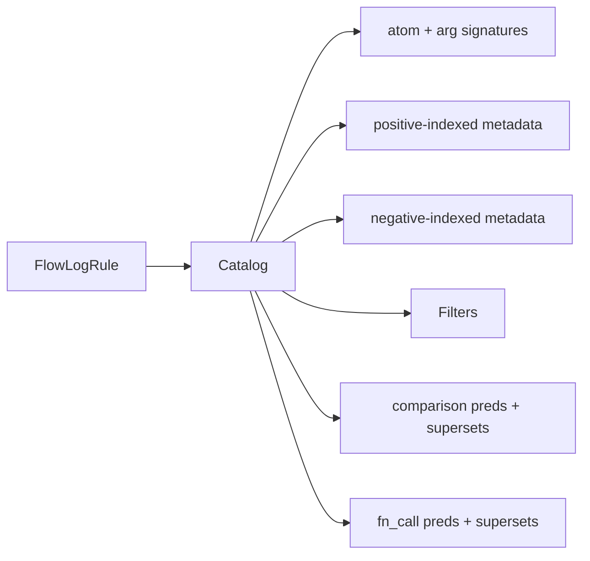

# `catalog/` — per-rule metadata for the planner

Pure analysis layer between the parsed AST and the planner. One [`Catalog`](rule.rs) per rule, holding compact signatures and lookup maps so the planner doesn't re-walk the AST every time it asks a question.

Two design choices drive most of it:

- **Twin index spaces** — positive and negative atoms have separate RHS indices. `positive_atom_rhs_ids[i]` maps the i-th positive atom back to its global body position. The planner usually wants positive-only indices when picking joins; negative atoms are anti-joins applied after.
- **Pre-computed supersets** — for each comparison/UDF/atom, the catalog records which positive atoms cover all of its variables, so the planner can decide where in the join order each predicate first becomes evaluable.

## Range-restriction enforcement

The catalog isn't passive: as it walks the body, it checks that every variable in a **negated atom**, comparison, or UDF call is bound by some positive atom. If not, it returns [`CatalogError::UnsafeVariable`](error.rs) with `UnsafePredicateKind` (`Negation` / `Comparison` / `FnCall`) naming where the unbound variable was found.

The typechecker deliberately defers this — it depends on RHS shape that only becomes obvious once positive-vs-negative is sorted out.

## Layout

| File | Holds |
|---|---|
| [`rule.rs`](rule.rs) | `Catalog` struct + the public surface. |
| `rule/populate.rs` | First-pass build: walk the AST, fill every signature/map/superset. |
| `rule/modify.rs` | In-place mutations (e.g. for incremental re-planning). |
| [`atom.rs`](atom.rs) | `AtomSignature`, `AtomArgumentSignature`. |
| [`predicate.rs`](predicate.rs) | `JoinPredicates`, `KvPredicates` — projected views the planner consumes. |
| [`filter.rs`](filter.rs) | `Filters` — local var-eq, const-eq, placeholder constraints. |
| [`compare.rs`](compare.rs), [`arithmetic.rs`](arithmetic.rs), [`fn_call.rs`](fn_call.rs) | RHS-position types for each kind of body predicate. |
| [`error.rs`](error.rs) | `CatalogError` + `UnsafePredicateKind`. |
