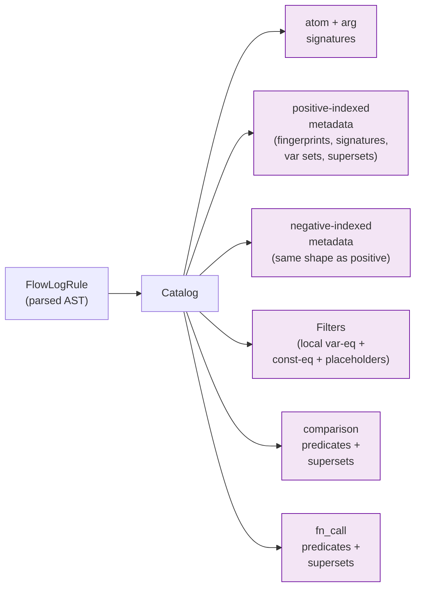

# `catalog/` — per-rule metadata for the planner

A pure analysis layer sitting **between** the parsed AST and the planner. Builds
compact signatures and lookup maps for everything the planner needs to ask
about a rule, so the planner can stay focused on shape selection rather than
re-traversing the AST every time.

```
parser ──▶ typechecker ──▶ stratifier ──▶ catalog ──▶ planner ──▶ codegen
                                          ^^^^^^^
                                          you are here
```

## What a `Catalog` holds

One [`Catalog`](rule.rs) per rule. Conceptually:



Two things drive most of the design:

1. **Twin index spaces.** Positive and negative atoms have **separate RHS
   indices** — `positive_atom_rhs_ids[i]` maps the i-th positive atom back to
   its global body position. The planner usually wants positive-only indices
   when picking joins; negative atoms are anti-joins, applied after.
2. **Supersets pre-computed.** For each comparison/UDF/atom, the catalog
   pre-computes which positive atoms cover all of its variables. The planner
   uses this to choose where in the join order each non-atom predicate can
   first be evaluated.

## Submodule map

| File | Holds |
|---|---|
| [`rule.rs`](rule.rs) | `Catalog` struct + the public surface used by the planner. |
| `rule/populate.rs` | First-pass build: walk the AST, fill every signature/map/superset list. |
| `rule/modify.rs` | In-place mutations (e.g. for incremental re-planning). |
| [`atom.rs`](atom.rs) | `AtomSignature` (positive/negative + RHS id) and `AtomArgumentSignature` (atom + column). |
| [`predicate.rs`](predicate.rs) | `JoinPredicates`, `KvPredicates` — projected views over the catalog used at join codegen time. |
| [`filter.rs`](filter.rs) | `Filters` — local variable-equality (`X = X` self-join), constant-equality (`A(X, 5)`), and placeholder (`A(X, _)`) constraints lifted out of the body. |
| [`compare.rs`](compare.rs) | `ComparisonExprPos` — RHS index of a comparison predicate. |
| [`arithmetic.rs`](arithmetic.rs) | `ArithmeticPos`, `FactorPos` — RHS indices for arithmetic body sites. |
| [`fn_call.rs`](fn_call.rs) | `FnCallPredicatePos` — RHS index of a UDF call. |
| [`error.rs`](error.rs) | `CatalogError` + `UnsafePredicateKind` — range-restriction violations the populate pass detects (e.g. a comparison or UDF using a variable that no positive atom binds). |

## Range-restriction (the one rule we *enforce*)

The catalog isn't just a passive cache: as it walks the body, it checks that
every variable in a **negated atom**, comparison, or UDF call is **bound by
some positive atom**. If not, it returns `CatalogError::UnsafeVariable` (the
`UnsafePredicateKind` field — `Negation` / `Comparison` / `FnCall` — names
*where* the unbound variable was found). This is the place range-restriction
is checked — the typechecker leaves it alone, because it depends on RHS shape
that only becomes obvious once you've sorted positive-vs-negative.

## Reading order

If you're new to this directory, read in this order:

1. `atom.rs` — the signature primitives.
2. `filter.rs` — what "local filter" means in this codebase.
3. `rule.rs` — the `Catalog` fields, in declaration order.
4. `rule/populate.rs` — how those fields get filled.
5. `predicate.rs` — the projected views the planner consumes.
