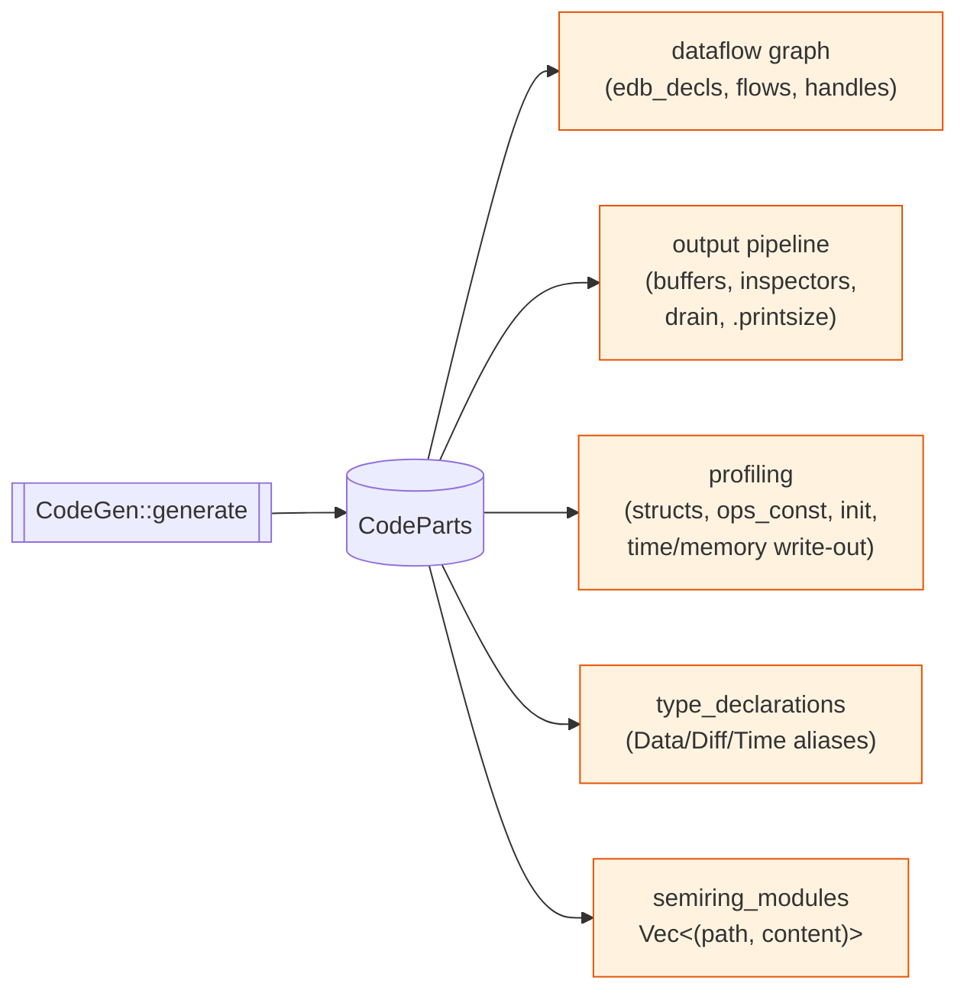
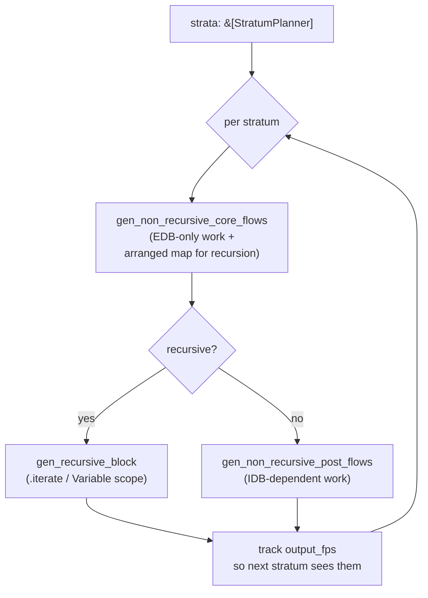

# `codegen/` — emit Rust + Timely / DD operator chains

The final compile stage. Takes a `Vec<StratumPlanner>` (the planner's output)
and produces a [`CodeParts`](code_parts.rs) bundle of `proc_macro2::TokenStream`
fragments. Both frontends — library mode (`flowlog-build`'s own `build/`
module) and binary mode (`flowlog-compiler`) — assemble those fragments into
their final Rust source.

```
parser ──▶ typechecker ──▶ stratifier ──▶ planner ──▶ codegen ──▶ Rust source
                                                       ^^^^^^^
                                                       you are here
```

## What comes out: the `CodeParts` bundle

`CodeParts` is intentionally a flat bag of `TokenStream`s rather than one
giant tree, so each frontend can pick the subset it needs:



Empty fragments stay empty when the program doesn't need them (e.g. the
profiling section is empty unless `--profile` is set).

## Per-stratum generation



Recursion is one-stratum-at-a-time. The non-recursive head of every stratum
runs first, producing arrangements the recursive block then re-uses inside
its `Variable` scope.

## Submodule map

| Submodule | Holds |
|---|---|
| [`flow/`](flow/) | The DD-operator emission core: `transformation.rs` (one match arm per `Transformation` variant), `recursive.rs` (`.iterate` / `Variable` scopes), `non_recursive.rs` (linear chains), and `mod.rs` (driver + arrangement-sharing). |
| [`aggregation/`](aggregation/) | One file per built-in aggregation operator: `sum`, `avg`, `min`, `max`, `count`, plus shared helpers in `common.rs`. Each emits the appropriate `reduce`-based DD pattern. |
| [`ty/`](ty/) | Type-token rendering: `data.rs` (Datalog `DataType` → Rust type tokens), `diff.rs` (the `Diff` semiring choice), `time.rs` (the `Time` lattice — `()` / `Product`-of-orders for nested `iterate`). |
| [`code_parts.rs`](code_parts.rs) | The `CodeParts` bundle definition + `collect_parts` driver that runs every pass. |
| [`features.rs`](features.rs) | `Features` — what the program actually uses (string interning? aggregation semirings? UDF file?), so the frontend's `Cargo.toml` and `use` block can be minimal. |
| [`idb_buffers.rs`](idb_buffers.rs) | `InspectorCodegen` — `inspect()` + drain code per `.output` relation; `gen_drain_block` and `field_accessor` are re-exported for the binary frontend. |
| [`edb_handles.rs`](edb_handles.rs) | `gen_edb_decls` — one `scope.new_collection::<_, Diff>()` per EDB. |
| [`semiring.rs`](semiring.rs) | Aggregation semiring module rendering — produces `semiring/<op>.rs` files included by the generated crate. |
| [`profile.rs`](profile.rs) | Static plan-graph rendering: `__FLOWLOG_OPS_JSON` const + per-worker time/memory write-out. |
| [`arg.rs`](arg.rs), [`ident.rs`](ident.rs) | Token-level helpers: column expressions, identifier disambiguation, fingerprint-keyed name maps. |
| [`dedup.rs`](dedup.rs) | Cross-stratum / cross-rule arrangement dedup so generated code arranges each `(key, value)` shape at most once. |
| [`error.rs`](error.rs) | `CodegenError`. |

## Two output paths share this module

- **Library mode** (`flowlog-build/src/build/`): consumes `CodeParts` directly,
  splices it into `$OUT_DIR/<stem>.rs`, and the user's crate `include!`s it.
- **Binary mode** (`flowlog-compiler`): consumes the *same* `CodeParts`, plus
  some extras (`Cargo.toml`, `main.rs` shell), then runs `cargo build`.

The fragments themselves are mode-agnostic; mode-specific *aliases* (e.g.
`use ::flowlog_runtime::serde;` in library mode) are added by each frontend.

## Reading order

1. [`code_parts.rs`](code_parts.rs) — what's in the bundle.
2. [`ty/data.rs`](ty/data.rs) — how types render.
3. [`flow/transformation.rs`](flow/transformation.rs) — the per-`Transformation`
   match (the bulk of the codegen).
4. [`flow/recursive.rs`](flow/recursive.rs) and
   [`flow/non_recursive.rs`](flow/non_recursive.rs) — driver glue.
5. [`features.rs`](features.rs) and [`idb_buffers.rs`](idb_buffers.rs) — the
   bits the frontends consume directly.
