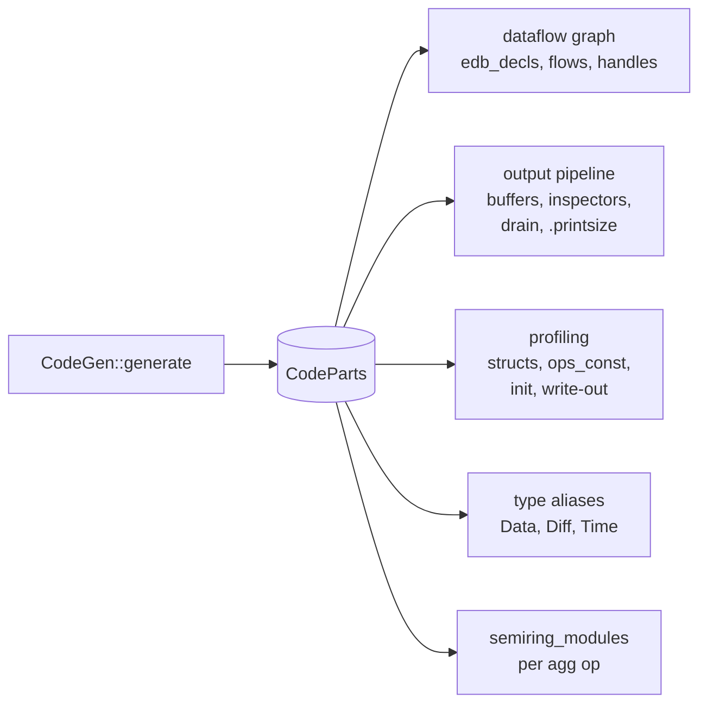
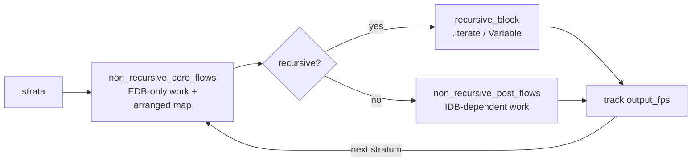

# `codegen/` — emit Rust + Timely / DD operator chains

The final compile stage. Takes `Vec<StratumPlanner>` and produces a flat [`CodeParts`](code_parts.rs) bundle of `proc_macro2::TokenStream` fragments. Both frontends — library mode ([`build/`](../build/)) and binary mode ([`flowlog-compiler`](../../../flowlog-compiler/)) — assemble those fragments into final Rust source.

## What comes out

`CodeParts` is intentionally a flat bag, so each frontend picks the subset it needs:

Empty fragments stay empty when the program doesn't need them (e.g. profiling is empty unless `--profile` is set).

## Per-stratum loop

Non-recursive head runs first, producing arrangements the recursive block reuses inside its `Variable` scope.

## Layout

| Submodule | Role |
|---|---|
| [`flow/`](flow/) | DD-operator emission: `transformation.rs` (one match arm per `Transformation` variant), `recursive.rs` (`.iterate`/`Variable`), `non_recursive.rs` (linear chains). |
| [`aggregation/`](aggregation/) | One file per built-in: `sum`, `avg`, `min`, `max`, `count`, plus shared `common.rs`. |
| [`ty/`](ty/) | Type-token rendering: `data.rs` (Datalog → Rust types), `diff.rs` (semiring choice), `time.rs` (lattice). |
| [`code_parts.rs`](code_parts.rs) | The `CodeParts` struct + `collect_parts` driver. |
| [`features.rs`](features.rs) | `Features` — what the program actually uses, so the frontend's `Cargo.toml` and `use` block can be minimal. |
| [`idb_buffers.rs`](idb_buffers.rs) | `InspectorCodegen` — `inspect()` + drain code per `.output`. |
| [`edb_handles.rs`](edb_handles.rs) | One `scope.new_collection::<_, Diff>()` per EDB. |
| [`semiring.rs`](semiring.rs), [`profile.rs`](profile.rs) | Semiring module rendering and profiling write-out. |
| [`arg.rs`](arg.rs), [`ident.rs`](ident.rs) | Token helpers: column expressions, identifier disambiguation. |
| [`dedup.rs`](dedup.rs) | Cross-stratum / cross-rule arrangement dedup. |
| [`error.rs`](error.rs) | `CodegenError`. |

## Two consumers, one bundle

Both modes consume the **same** `CodeParts`; mode-specific aliases (e.g. `use ::flowlog_runtime::serde;` in library mode) are applied by each frontend.

| Mode | How it's used |
|---|---|
| Library ([`build/`](../build/)) | Splices fragments into `$OUT_DIR/<stem>.rs`; user `include!()`s. |
| Binary ([`flowlog-compiler`](../../../flowlog-compiler/)) | Adds `Cargo.toml`, `main.rs` shell; runs `cargo build`. |
