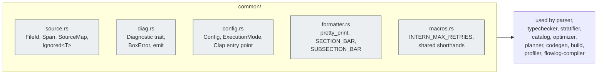

# `common/` — shared primitives across every pipeline stage

The thin foundation every other module uses. Source locations, diagnostic
infrastructure, the `Config` struct, and the `pretty_print` / formatting
helpers. Everything here is **stage-agnostic** — if it touches `Pair<Rule>`
or `Catalog` or `Transformation`, it doesn't belong here.

> `pub mod common` is exported `#[doc(hidden)]` from `flowlog-build/src/lib.rs`
> because `flowlog-compiler` and integration tests reach into it. External
> crates should not.

## What lives here

## File-by-file

| File | Public surface | Why it's here |
|---|---|---|
| [`source.rs`](source.rs) | `FileId`, `Span`, `SourceMap` | Anchor every AST node to a byte range in a file so diagnostics can quote the user's source. `SourceMap` impls `codespan_reporting::files::Files` so it plugs straight into the renderer. Also exports `Ignored<T>` — a wrapper that opts a field out of derived `PartialEq`/`Eq`/`Hash`, used to attach metadata (spans, profiler counters) without disturbing structural equality. |
| [`diag.rs`](diag.rs) | `Diagnostic` trait, `BoxError`, `InternalError`, `emit`, `BUG_URL` | Every stage defines its own error enum and `impl Diagnostic`; the blanket `From` boxes them into `BoxError` so `?` works through generic-error functions. `emit` renders a `BoxError` against a `SourceMap` for `cargo build`-friendly output. `BUG_URL` is the shared "please file a bug" link for `InternalError` cases (grammar-contract violations, etc.). |
| [`config.rs`](config.rs) | `Config`, `ExecutionMode`, `get_example_files` | The top-level command-line + library-mode `Builder` projection. `ExecutionMode` is the four-way batch×datalog/extended matrix; `Config` carries every flag the rest of the pipeline reads. |
| [`formatter.rs`](formatter.rs) | `pretty_print` (re-export), `SECTION_BAR`, `SUBSECTION_BAR` | Wrap `prettyplease` so generated source comes out human-readable, plus the ASCII bars various `tracing` log lines decorate phase boundaries with. |
| [`macros.rs`](macros.rs) | `INTERN_MAX_RETRIES` | Shared constants/macros that don't belong to any one stage. |
| [`mod.rs`](mod.rs) | `compute_fp` (intra-crate) | Re-exports the file's public surface; also defines the `compute_fp<T: Hash>` helper used everywhere fingerprints come up (`HashMap` keys for arrangement dedup, `Catalog` atom fingerprints, etc.). |

## A few load-bearing details

- **`FileId::DUMMY`** marks synthesised AST nodes (e.g. the desugared head of
  a rule). `primary_label`/`secondary_label` return `None` for dummy spans so
  the renderer doesn't point at a bogus offset.
- **`Diagnostic` is a trait, not a struct.** Each error enum implements it;
  there's no central `enum AnyError`. This keeps stage-local errors strongly
  typed and free of upstream types.
- **`Ignored<T>` is the canonical "metadata" wrapper.** Two `FlowLogRule`s
  that differ only in their span should still hash equal — that's what
  enables fingerprint-based dedup. Wrap any new `Span`-like or
  profiler-counter-like field in `Ignored<T>`.
- **`compute_fp`** uses `DefaultHasher`. It's deterministic *within* a build
  but **not** stable across Rust versions. Don't persist a fingerprint
  outside one compilation.

## Don't add things here that…

- Depend on `parser::*`, `catalog::*`, `planner::*`, `codegen::*` — those
  belong in their respective stages.
- Are mode-specific (library vs binary) — those belong in `build/` or
  `flowlog-compiler/`.
- Are pure data types only one stage needs — colocate them with that stage.
