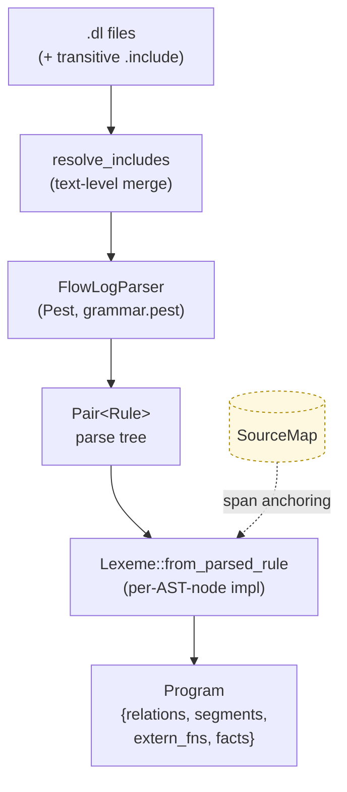

# `parser/` — Pest grammar → typed AST

The first stage of the compile pipeline. Reads `.dl` source text, applies
`.include` directives, runs Pest over `grammar.pest`, and produces a typed
[`Program`](program.rs) tree the rest of the pipeline operates on.

## Place in the pipeline

```
.dl source ──▶ parser ──▶ typechecker ──▶ stratifier ──▶ planner ──▶ codegen
              ^^^^^^
              you are here
```

## How parsing works



`.include` resolution happens **before** parsing, on raw text. The parser
itself never has to merge two partially-parsed programs — by the time Pest
runs, there is exactly one combined source string. Each character keeps a
[`FileId`](../common/source.rs) so diagnostics can still cite the right file.

The trait that drives the lift from parse-tree to AST is [`Lexeme`](mod.rs):

```rust
pub(crate) trait Lexeme: Sized {
    fn from_parsed_rule(pair: Pair<Rule>, file: FileId) -> Result<Self, ParseError>;
}
```

Every public AST type implements it, so adding a new grammar production is
"add a Pest rule + add a `Lexeme` impl".

## Submodule map

| Submodule | Holds |
|---|---|
| [`primitive/`](primitive/) | `DataType` (Int8…UInt64, Float32/64, Bool, String, Symbol) and `ConstType` literal nodes — including the polymorphic `Int(_)`/`Float(_)` placeholders that `typechecker::pin` later collapses to a concrete width. |
| [`declaration/`](declaration/) | `.decl` relations, `.input`/`.output`/`.printsize` directives, attributes, and `.extern fn` UDF declarations. |
| [`logic/`](logic/) | The body of a rule: `Atom`, `Predicate`, `Arithmetic`, `Comparison`, `FnCall`, `Aggregation`, `Head`, `Rule`, plus `LoopBlock` for extended-mode `loop`/`fixpoint` regions. |
| [`program.rs`](program.rs) | The `Program` root: relations + ordered `Vec<Segment>` + UDFs + inline facts. Owns the file-loading entry point and `.include` resolution. |
| [`segment.rs`](segment.rs) | `Segment::{Plain, Loop, Fixpoint}` — the ordered unit downstream stages walk. Loop/Fixpoint segments are **hard barriers**: the stratifier may not move rules across them. |
| [`error.rs`](error.rs) | `ParseError` with span-anchored variants. `ParseError::Internal` covers grammar-contract violations the grammar should have made unreachable. |
| [`grammar.pest`](grammar.pest) | The single source of truth for FlowLog syntax. |

## Segment model (a small but load-bearing detail)

A program is processed as a flat `Vec<Segment>` in source order:

```text
.decl ...
rule_a(X) :- edb(X).             ┐
rule_b(X) :- rule_a(X).          │ Segment::Plain
                                 ┘
fixpoint {                       ┐
    reach(X, Z) :- edge(X, Y),   │ Segment::Fixpoint
                   reach(Y, Z).  │ (hard barrier)
}                                ┘
out(X) :- rule_b(X).             ─── Segment::Plain
```

`Plain` segments stratify as usual. `Loop`/`Fixpoint` segments map to **exactly
one recursive stratum each**, regardless of how many rules they contain — this
is what gives extended-mode programs explicit control over recursion.

## Adding new syntax

1. Add a Pest rule to `grammar.pest`.
2. Add the AST node (struct/enum) under the right submodule.
3. Implement `Lexeme::from_parsed_rule` for it.
4. Splice it into its parent's `Lexeme::from_parsed_rule` (e.g. `Predicate`,
   `Rule`, or `Program`).
5. Add a span-anchored variant to `ParseError` if it can fail with a
   user-facing message.

After parsing, every AST node carries a [`Span`](../common/source.rs) — that's
how the typechecker, planner, and codegen produce diagnostics that point at
the user's source instead of the enclosing rule.
