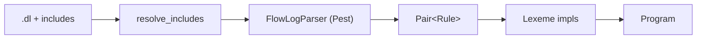

# `parser/` — Pest grammar → typed AST

The first pipeline stage. Reads `.dl` source, resolves `.include` directives at the text level, runs Pest over [`grammar.pest`](grammar.pest), and produces a typed [`Program`](program.rs).



`.include`s are merged into a single source string **before** parsing, so the parser never has to stitch two parse trees. Each character keeps a [`FileId`](../common/source.rs) so diagnostics still cite the right file.

The lift from parse tree to AST is driven by one trait:

```rust
pub(crate) trait Lexeme: Sized {
    fn from_parsed_rule(pair: Pair<Rule>, file: FileId) -> Result<Self, ParseError>;
}
```

Every public AST type implements it. Adding a new construct = "add a Pest rule + add a `Lexeme` impl".

## Layout

| Submodule | Holds |
|---|---|
| [`primitive/`](primitive/) | `DataType` (`Int8…UInt64`, `Float32/64`, `Bool`, `String`; `"symbol"` ≡ `"string"`), `ConstType` literals (incl. polymorphic `Int(_)`/`Float(_)` later collapsed by `typechecker::pin`). |
| [`declaration/`](declaration/) | `.decl`, `.input`/`.output`/`.printsize`, attributes, `.extern fn`. |
| [`logic/`](logic/) | Rule body: `Atom`, `Predicate`, `Arithmetic`, `ComparisonExpr`, `FnCall`, `Aggregation`, `Head`, `FlowLogRule`, `LoopBlock`. |
| [`program.rs`](program.rs) | The `Program` root + file-loading entry point + `.include` resolution. |
| [`segment.rs`](segment.rs) | `Segment::{Plain, Loop, Fixpoint}` — Loop/Fixpoint are **hard barriers** the stratifier cannot move rules across. |
| [`error.rs`](error.rs) | `ParseError` (span-anchored). `Internal` covers grammar-contract violations. |
| [`grammar.pest`](grammar.pest) | The single source of truth for FlowLog syntax. |

## Segment model

A program is a flat `Vec<Segment>` walked in source order:

```text
.decl ...
rule_a(X) :- edb(X).            ┐ Segment::Plain
rule_b(X) :- rule_a(X).         ┘
fixpoint {                      ┐ Segment::Fixpoint
    reach(X, Z) :- edge(X, Y),  │ (hard barrier)
                   reach(Y, Z). │
}                               ┘
out(X) :- rule_b(X).            ── Segment::Plain
```

Each `Loop`/`Fixpoint` segment becomes **exactly one recursive stratum**, regardless of how many rules it contains — that's how extended-mode programs get explicit control over recursion.

## Adding new syntax

1. Add a Pest rule in `grammar.pest`.
2. Add the AST node under the right submodule.
3. Implement `Lexeme::from_parsed_rule` for it.
4. Splice it into the parent's `Lexeme::from_parsed_rule` (e.g. `Predicate`, `FlowLogRule`, `Program`).
5. Add a span-anchored `ParseError` variant if it can fail user-visibly.

Every AST node carries a [`Span`](../common/source.rs) so downstream stages can produce source-pointed diagnostics.
