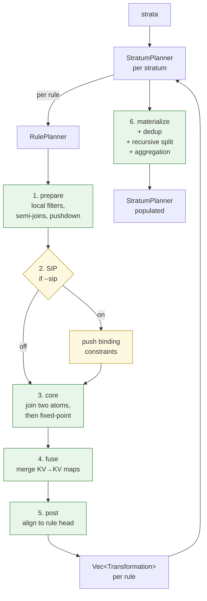

# `planner/` — strata → transformation graphs

The biggest module in `flowlog-build`. Turns each rule into a sequence of [`Transformation`](transformation.rs) operators that codegen will emit as a Differential Dataflow chain.

## Two-level plan

`StratumPlanner` orchestrates per-rule `RulePlanner`s. Phases 1–5 run per rule (Phase 2 SIP is conditional). Phase 6 happens once at the stratum level: dedup transformations across rules (so DD arrangements can be shared), split EDB-only work from IDB-dependent work (recursive part runs inside a `Variable`/`iterate`), and record aggregation metadata for codegen.

## Transformation alphabet

Every plan is a DAG of [`Transformation`](transformation.rs) nodes:

| Variant | Arity | Purpose |
|---|---|---|
| `RowToRow` | unary | filter / project / map a row collection |
| `RowToKv` | unary | structure rows into KV (joins need keys) |
| `KvToRow` | unary | strip the key after a join |
| `KvToKv` | unary | rekey or remap (target of `fuse`) |
| `Jn*` | binary | join variants (`JnToRow`, `JnToKv`, `NJnToRow`, `NJnToKv`) |
| Aggregation | special | handled at the stratum level, not per-rule |

A [`Collection`](collection.rs) is what flows between transformations — a fingerprinted relation with explicit `(key_args, value_args)` layout. Two transformations with the same fingerprint can share a single DD arrangement downstream.

## Layout

| File / dir | Role |
|---|---|
| [`mod.rs`](mod.rs) | Re-exports. |
| [`stratum_planner.rs`](stratum_planner.rs) | `StratumPlanner` — orchestrates per-rule planning, dedup, recursive split, aggregation, profiler hooks. |
| [`rule_planner.rs`](rule_planner.rs) + [`rule_planner/`](rule_planner/) | `RulePlanner` and its phase files (`prepare`, `core`, `fuse`, `post`, plus shared `common.rs` and `sip.rs`). |
| [`transformation.rs`](transformation.rs) + [`transformation/`](transformation/) | The `Transformation` enum, `TransformationFlow` (per-flow KV/row layout), `TransformationInfo` (display + dependency analysis). |
| [`collection.rs`](collection.rs) | `Collection` — fingerprinted relation with key/value layout. |
| [`argument.rs`](argument.rs), [`arithmetic.rs`](arithmetic.rs), [`compare.rs`](compare.rs), [`fn_call.rs`](fn_call.rs) | Per-kind argument types referenced inside transformations. |
| [`constraint.rs`](constraint.rs) | `Constraints` surfaced downstream. |
| [`error.rs`](error.rs) | `PlanError`. |

Bottom-up reading order: data model first ([`collection.rs`](collection.rs), arg types) → operator alphabet ([`transformation.rs`](transformation.rs)) → phases ([`rule_planner/core.rs`](rule_planner/core.rs) and friends) → orchestration ([`stratum_planner.rs`](stratum_planner.rs)).
