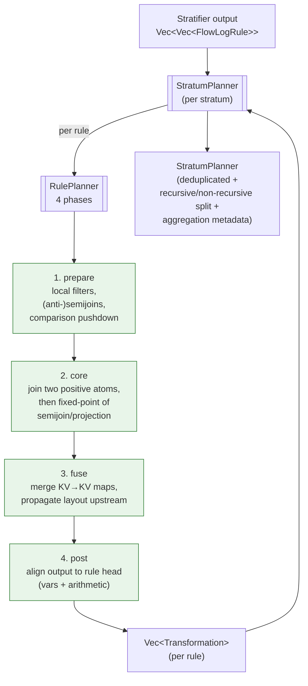

# `planner/` — lower strata into transformation graphs

The planner is the **biggest module** in `flowlog-build`. It turns each rule
into a sequence of `Transformation` operators that the codegen stage will
emit as a Differential Dataflow operator chain. This module is where most of
the design effort lives.

```
parser ──▶ typechecker ──▶ stratifier ──▶ catalog ──▶ optimizer ──▶ planner ──▶ codegen
                                                                    ^^^^^^^
                                                                    you are here
```

## The two-level plan



`StratumPlanner` owns multiple `RulePlanner`s. After every rule plans
independently, the stratum planner **deduplicates** transformations across
rules (DD's job is easier when shared sub-plans are shared) and **separates
EDB-only work from IDB-dependent work** so the recursive part of a stratum
runs inside a `Variable` / `iterate` and the non-recursive part runs outside.

## Transformation alphabet

Every plan is a DAG of [`Transformation`](transformation.rs) nodes. The
shape vocabulary:

| Variant | Arity | Purpose |
|---|---|---|
| `RowToRow` | unary | filter / project / map a row collection |
| `RowToKv`  | unary | structure a row collection into KV (joins need keys) |
| `KvToRow`  | unary | strip the key after a join |
| `KvToKv`   | unary | rekey or remap (target of `fuse`) |
| `Join` *etc.* | binary | core relational binary ops |
| Aggregation | special | handled at the stratum level, not per-rule |

A [`Collection`](collection.rs) is what flows between transformations — a
fingerprinted relation with explicit `(key_args, value_args)` layout. The
**fingerprint** is what enables dedup: two transformations producing the same
fingerprint can share a single DD arrangement downstream.

## Layout

| File / dir | Role |
|---|---|
| [`mod.rs`](mod.rs) | Re-exports (`StratumPlanner`, `PlanError`, `Transformation`, `TransformationInfo`, `Collection`, `KeyValueLayout`, …). |
| [`stratum_planner.rs`](stratum_planner.rs) | `StratumPlanner` — orchestrates per-rule planning, dedup, recursive/non-recursive split, aggregation metadata, profiler hooks. |
| [`rule_planner.rs`](rule_planner.rs) + [`rule_planner/`](rule_planner/) | `RulePlanner` and its 4-phase pipeline (`prepare`, `core`, `fuse`, `post`) plus shared utilities (`common.rs`) and SIP helpers (`sip.rs`). |
| [`transformation.rs`](transformation.rs) + [`transformation/`](transformation/) | The `Transformation` enum + `TransformationFlow` (per-flow row/KV layout) + `TransformationInfo` (display + dependency analysis). |
| [`collection.rs`](collection.rs) | `Collection` — fingerprinted intermediate relation with key/value argument signatures. |
| [`argument.rs`](argument.rs) | `TransformationArgument` — column references inside a transformation. |
| [`arithmetic.rs`](arithmetic.rs) | `ArithmeticArgument`, `FactorArgument` — when a transformation column is an expression, not a raw variable. |
| [`compare.rs`](compare.rs) | `ComparisonExprArgument` — comparison predicate as a planning operand. |
| [`constraint.rs`](constraint.rs) | `Constraints` — passed downstream to surface filter / equality requirements. |
| [`fn_call.rs`](fn_call.rs) | `FnCallPredicateArgument` — UDF call as a planning operand. |
| [`error.rs`](error.rs) | `PlanError`. |

## Reading order

This module rewards reading bottom-up:

1. [`collection.rs`](collection.rs) — the data model (`(key, value)` rows).
2. [`argument.rs`](argument.rs), [`arithmetic.rs`](arithmetic.rs),
   [`compare.rs`](compare.rs), [`fn_call.rs`](fn_call.rs) — what a column /
   predicate looks like inside a transformation.
3. [`transformation.rs`](transformation.rs) — the operator alphabet.
4. [`rule_planner/core.rs`](rule_planner/core.rs) and the other phase files
   in the order `prepare` → `core` → `fuse` → `post`.
5. [`stratum_planner.rs`](stratum_planner.rs) — how it all comes together.
