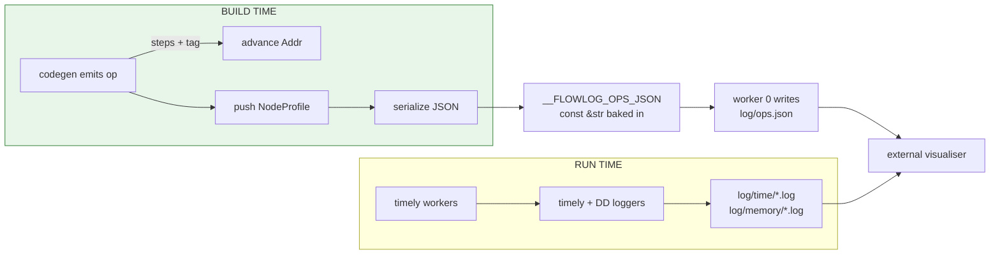

# `profiler/` — operator-level profiling

Optional. Built only with `-P` / `--profile` (CLI) or `Builder::profile(true)` (library). Records a static plan graph at compile time and lines it up with timely's runtime operator logs at run time, so each operator a tuple flows through can be attributed back to the FlowLog construct that emitted it.

> **🚧 Datalog modes only.** `--profile` combined with `extend-batch` or `extend-inc` panics with `unimplemented!` in [`common/config.rs`](../common/config.rs) — the operator step counts in [`steps.rs`](steps.rs) only cover `DatalogBatch` / `DatalogInc`, and extended-mode operators (loop conditions, UDF pipelines) aren't tracked yet.

## Two halves



## Why "predicted address range"

Timely tags every operator with a nested-scope address like `[0, 8, 10]`. DD emits **multiple** timely operators per logical call (`.threshold(...)` = 4 ops, `.consolidate()` = 3 ops). The profiler predicts how many timely ops each codegen call will create — that's [`steps.rs`](steps.rs) — and advances [`Addr`](addr.rs) by that count. At runtime the visualiser maps an actual log address back to the FlowLog construct that owns it.

## Layout

| File | Holds |
|---|---|
| [`mod.rs`](mod.rs) | `Profiler` struct, `with_profiler` lift helpers, JSON write-out, builder API. |
| [`operators.rs`](operators.rs) | One method per logical operator the codegen emits (`Input`, `Stage`, `Runtime`, `Inspect`). |
| [`steps.rs`](steps.rs) | The `(mode, codegen pattern) → timely op count` table. |
| [`addr.rs`](addr.rs) | `Addr(Vec<u32>)` — nested scope address with `enter`/`leave`/`advance`. |
| [`node.rs`](node.rs) | `NodeProfile` + `NodeManager` (scope tracking, address counter, fingerprint dedup). |
| [`rule.rs`](rule.rs) | `RuleProfile` — one rule's plan tree. |

## How codegen plugs in

Codegen reaches the profiler through `with_profiler(profiler, |p| …)` so the same code paths work whether profiling is on or off:

```rust
with_profiler(profiler, |p| p.input_edb_operator(name, var));
with_profiler(profiler, |p| p.enter_scope());      // before .iterate()
// … emit DD operator chain …
with_profiler(profiler, |p| p.leave_scope());      // after .iterate()
```

## Output artefacts

| File pattern | When | What |
|---|---|---|
| `<stem>_log/ops.json` | worker 0 at startup | static plan graph (`__FLOWLOG_OPS_JSON`) |
| `<stem>_log/time/time_worker_t0_<i>.log` | end of run *(batch)* | timely op timing per worker |
| `<stem>_log/time/time_worker_t<ts>_<i>.log` | per commit *(incremental)* | timely op timing per (timestamp, worker) |
| `<stem>_log/memory/memory_worker_t0_<i>.log` | end of run *(batch)* | DD arrangement memory per worker |
| `<stem>_log/memory/memory_worker_t<ts>_<i>.log` | per commit *(incremental)* | DD arrangement memory per (timestamp, worker) |
