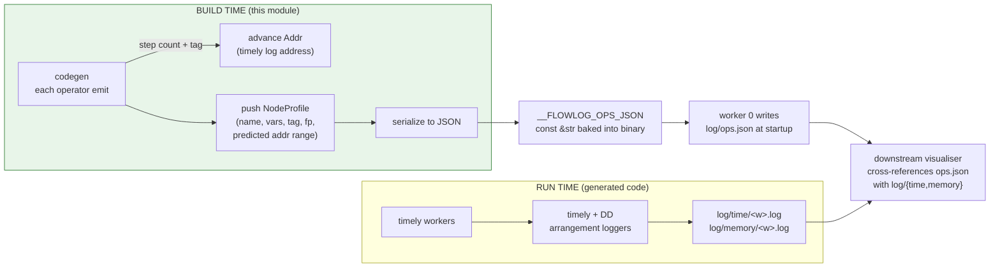

# `profiler/` — operator-level profiling

Optional. Built only when the program is compiled with `-P` / `--profile` (CLI)
or `Builder::profile(true)` (library mode). Records a **static plan graph** at
compile time and lines it up with **timely's runtime operator logs** at run
time, so each operator a tuple flows through can be attributed to the FlowLog
construct that emitted it.

> **🚧 Datalog modes only.** `--profile` combined with `extend-batch` or
> `extend-inc` panics with `unimplemented!` in
> [`common/config.rs`](../common/config.rs) — the operator step counts in
> [`steps.rs`](steps.rs) have only been verified for `DatalogBatch` and
> `DatalogInc`, and extended-semantics operators (loop conditions, UDF
> pipelines) aren't tracked yet. Tracking extended modes here is a clean
> follow-up.

```
parser ──▶ typechecker ──▶ stratifier ──▶ planner ──▶ codegen ──▶ executable
                                                       │           │
                                                  insert_rule    runtime
                                                  push_node      logs
                                                       │           │
                                                       ▼           ▼
                                                    profiler/  ──▶ ops.json + log/{time,memory}/*
                                                    ^^^^^^^^^
                                                    you are here
```

## Two halves: build-time and run-time



## Why "predicted address range"

Timely tags every operator with a nested-scope address like `[0, 8, 10]`. DD
emits multiple timely operators per logical call (e.g. `.threshold(...)` =
4 ops, `.consolidate()` = 3 ops). The profiler **predicts** how many timely
operators each codegen call will create — that's the
[`steps`](steps.rs) module — and advances [`Addr`](addr.rs) by that count.
At runtime the visualiser maps an actual log address back to the FlowLog
construct that owns it.

## Submodule map

| File | Holds |
|---|---|
| [`mod.rs`](mod.rs) | `Profiler` struct (rules + nodes), `with_profiler` / `with_profiler_ref` lift helpers, JSON write-out, `insert_rule` / `push_node` builder API. |
| [`operators.rs`](operators.rs) | One method per logical operator type the codegen emits — `input_edb_operator`, `stage_*`, `runtime_*`, `inspect_*`. Each calls `push_node` with the right tag (`Input` / `Stage` / `Runtime` / `Inspect`). |
| [`steps.rs`](steps.rs) | The `(execution mode, codegen pattern) → timely op count` table. Single source of truth for address advancement. |
| [`addr.rs`](addr.rs) | `Addr(Vec<u32>)` — nested scope address with `enter_scope`/`leave_scope`/`advance`, derives `Ord` for `BTreeMap` keying. |
| [`node.rs`](node.rs) | `NodeProfile` (one logical operator) + `NodeManager` (scope/block tracking, address counter, fingerprint dedup). |
| [`rule.rs`](rule.rs) | `RuleProfile` (one rule's plan tree as a list of `((parent_fp, child_fp), addr_low)` triples). |

## Where it plugs into codegen

Codegen reaches the profiler through `with_profiler(profiler, |p| p.something())`
so the same code paths work whether profiling is on or off:

```rust
with_profiler(profiler, |p| p.input_edb_operator(name, var));   // before each codegen step
with_profiler(profiler, |p| p.enter_scope());                   // before .iterate()
// … emit DD operator chain …
with_profiler(profiler, |p| p.leave_scope());                   // after .iterate()
```

## Output artefacts

| File | When | What |
|---|---|---|
| `<stem>_log/ops.json` | written by worker 0 at engine startup | the static plan graph baked in as `__FLOWLOG_OPS_JSON` |
| `<stem>_log/time/time_worker_t0_<i>.log` *(batch)* | end of run | timely operator timing, one file per worker |
| `<stem>_log/time/time_worker_t<ts>_<i>.log` *(incremental)* | per commit | timely operator timing, one file per (timestamp, worker) |
| `<stem>_log/memory/memory_worker_t0_<i>.log` *(batch)* | end of run | DD arrangement memory, one file per worker |
| `<stem>_log/memory/memory_worker_t<ts>_<i>.log` *(incremental)* | per commit | DD arrangement memory, one file per (timestamp, worker) |

These are picked up by the external profile-visualizer tool (separate repo).
