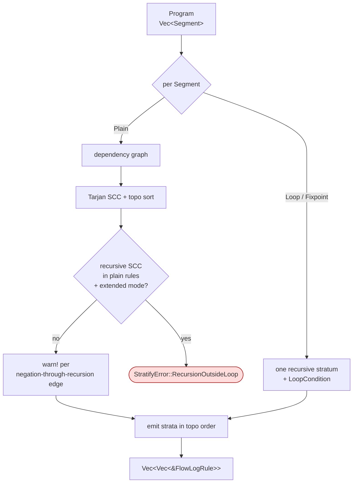

# `stratifier/` — SCC-based rule scheduling

Decides the order in which rule groups must run so every rule's dependencies are computed before it fires. Built once per program by `Stratifier::from_program(&Program, extended: bool)`.

## Vocabulary

- **Stratum** — a set of rules evaluated as a unit. Rules in stratum *i* may only depend on relations produced by strata *0…i-1*.
- **Recursive stratum** — contains a cycle (multi-rule SCC, or a self-recursive rule). Run to fixpoint.
- **Non-recursive stratum** — single pass.

## How it runs

Cross-segment edges are ignored — prior segments are treated as already-computed EDB. `Loop`/`Fixpoint` segments become one recursive stratum, regardless of internal rule count.

## Two semantic modes

| `extended` | Plain-rule recursion | Loop-block recursion | Status |
|---|---|---|---|
| `false` *(Datalog)* | **Allowed** via SCC detection (classic stratified-Datalog). | Allowed; one stratum per block. | ✅ supported |
| `true` *(Extended)* | **Hard error** (`StratifyError::RecursionOutsideLoop`). | The only place recursion is allowed. | 🚧 partial; `extend-batch` has fixtures, `extend-inc` has none, `--profile` panics. |

The lever pulled by `--mode extend-batch` / `--mode extend-inc`.

## Negation safety

A negation edge that closes a cycle (`!p :- q`, `q :- p`) is classically unstratifiable. The dependency graph tracks `negative_edges` separately and the stratifier currently logs a `warn!` per such edge (see `warn_negation_edges` in [`core.rs`](core.rs)) — sorted in `BTreeSet` order for deterministic output. **Advisory only**, not fatal; promoting this to a hard `StratifyError` is future work.

The hard errors that *are* raised live in [`error.rs`](error.rs): `RecursionOutsideLoop`, `IterativeNotInLoopHead`, `IterativeNotRecursive`, `ForwardReference`, and empty/malformed loop variants.

## Layout

| File | Holds |
|---|---|
| [`mod.rs`](mod.rs) | Re-exports `Stratifier`, `StratifyError`. |
| [`core.rs`](core.rs) | The driver: per-segment loop, SCC handling, public API. |
| [`dependency_graph.rs`](dependency_graph.rs) | `DependencyGraph` — local edges + separate negation edges. |
| [`error.rs`](error.rs) | `StratifyError` (span-anchored). |
