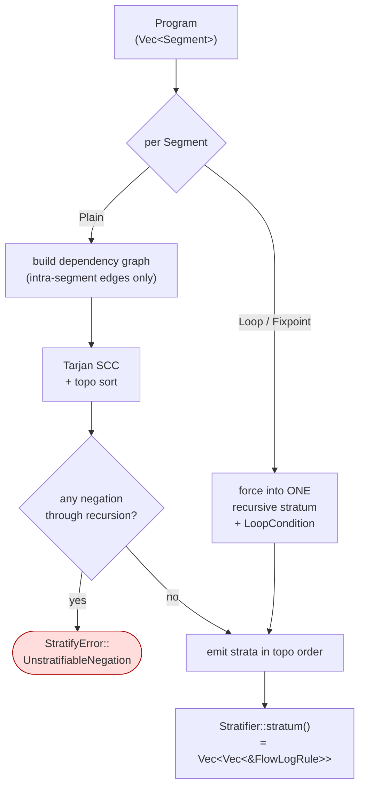

# `stratifier/` — SCC-based rule scheduling

Decides **the order** in which rule groups must run so every rule's dependencies
are fully computed before it fires. One public type — `Stratifier` — produced
once per program by `Stratifier::from_program(&Program, extended: bool)`.

```
parser ──▶ typechecker ──▶ stratifier ──▶ planner ──▶ codegen
                          ^^^^^^^^^^^
                          you are here
```

## Vocabulary

- **Stratum** — a set of rules that evaluate as a unit. Rules within the same
  stratum may depend on each other (they form an SCC); rules in stratum *i*
  may only depend on relations produced by strata *0…i-1*.
- **Recursive stratum** — contains a cycle: either a multi-rule SCC, or a
  single rule that references its own head. Evaluated to fixpoint.
- **Non-recursive stratum** — no cycle. Single pass.

## How it runs



Cross-segment edges are ignored — the stratifier treats prior segments as
already-computed EDB by the time the current segment runs. Each `Plain`
segment stratifies independently; each `Loop`/`Fixpoint` segment becomes
exactly one recursive stratum, regardless of how many rules it contains.

## Two semantic modes

| `extended` | Plain-rule recursion | Loop-block recursion |
|---|---|---|
| `false` (Datalog mode) | **Allowed** — handled implicitly via SCC detection (classic stratified-Datalog semantics). | Allowed; one stratum per block. |
| `true`  (Extended mode) | **Hard error** (`StratifyError`). Recursion *must* be expressed via `loop`/`fixpoint` blocks. | The only place recursion is allowed. |

This is the lever the user pulls with `--mode extend-batch` / `--mode extend-inc`.

## Negation safety

A negation edge that closes a cycle is unstratifiable (`!p :- q`, `q :- p`).
The dependency graph tracks `negative_edges` separately so an error like
`negation through recursion: q → ¬p → … → q` can be reported with the exact
edge that broke things — sorted in `BTreeSet` order for deterministic output.

## Layout

| File | Holds |
|---|---|
| [`mod.rs`](mod.rs) | Crate-level rustdoc + re-exports (`Stratifier`, `StratifyError`). |
| [`core.rs`](core.rs) | `Stratifier` itself: per-segment driver, recursive/non-recursive classification, loop-block handling, the public API. |
| [`dependency_graph.rs`](dependency_graph.rs) | `DependencyGraph` — local indices over a single segment's rules; tracks polarity-agnostic edges plus a separate set of negation edges. |
| [`error.rs`](error.rs) | `StratifyError` — extended-mode plain-rule recursion + negation-through-recursion variants, with span-anchored offending rules. |

## Reading order

1. [`mod.rs`](mod.rs) — concept overview.
2. [`dependency_graph.rs`](dependency_graph.rs) — what an edge looks like.
3. [`core.rs`](core.rs) — the per-segment driver and SCC handling.
