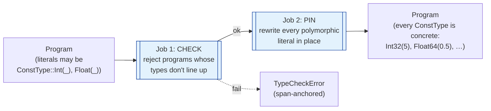

# `typechecker/` — type checking + const-type inference

Runs **after** parse, **before** stratification. Single public entry point:
`check_program(&mut Program) -> Result<(), TypeCheckError>`.

```
parser ──▶ typechecker ──▶ stratifier ──▶ planner ──▶ codegen
            ^^^^^^^^^^^
            you are here
```

## Two jobs in one pass



After `Ok(())`, **no polymorphic literal survives anywhere in the program** —
catalog, planner, and codegen can call `data_type()` unconditionally. Spans
come from the AST so diagnostics point at the offending expression, not the
enclosing rule.

## Walk

For each segment → each rule (and each rule inside a `loop`/`fixpoint` block) →
each fact:

1. Bind variable types from **positive-atom columns** against the relation's
   `.decl` (`DeclTypes`).
2. Visit every body site (atoms, arithmetic, comparisons, UDF calls,
   aggregations) and check it against that binding map.
3. **Pin** each `ConstType::Int(_)` / `Float(_)` placeholder to the concrete
   type derived from its surrounding context (via `ConstType::pin`).
4. Visit the head and check head arity + per-column types against the
   relation's `.decl`.

## What we reject

| Category | Example |
|---|---|
| Conflicting variable types | `A(x, _), B(x, _)` where `A`/`B` disagree on column 0 |
| Mixed concrete arithmetic | `Int32 + Float64`, `x = s` where `x: Int32`, `s: String` |
| Operator/type mismatch | `+ - * / %` on `Bool`/`String`, `cat` on non-string, `< >` on `Bool` |
| Constant-family clash | `5.0` into `Int32`, `"x"` into `Bool` |
| UDF errors | undeclared name, wrong arity, arg of wrong family |
| Aggregation errors | `sum`/`avg`/`min`/`max` over non-numeric input, output type contradicting op |
| Head mismatch | head arity or column type ≠ relation `.decl` |

## What we allow (deliberately)

- **Integer width is contextual.** `5` matches any `Int8…UInt64` column;
  context fixes the width and `pin` writes it back.
- **Float width is contextual.** Same pattern for `Float32`/`Float64`.
- **No range checking.** `300` into `UInt8` passes here and is caught later
  by `rustc` on the generated code.
- **Unbound variables in negated atoms / comparisons / UDF calls** — those are
  reported by the *range-restriction* pass, not here.

## Layout

| File | Holds |
|---|---|
| `mod.rs` | `check_program`, `check_rule`, `check_and_pin_facts`, the type-binding map. |
| `error.rs` | `TypeCheckError` — every variant carries a `Span`, plus the conflicting types where applicable. |

This module has no submodules — the whole pass is short enough to live in
`mod.rs`. If it grows, candidates for splitting are: variable-binding,
expression checking (atoms/arith/compare), aggregation checking, head
checking, and fact pinning.
