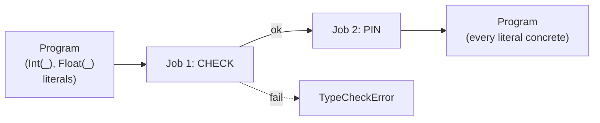

# `typechecker/` — type checking + const-type inference

Runs after parse, before stratify. One public entry point:

```rust
pub fn check_program(program: &mut Program) -> Result<(), TypeCheckError>;
```

## Two jobs in one pass



After `Ok(())`, no polymorphic literal survives — catalog, planner and codegen call `data_type()` unconditionally. Spans come from the AST, so diagnostics point at the offending expression.

For each segment → each rule (incl. inside `loop`/`fixpoint`) → each fact:

1. Bind variable types from positive-atom columns against `.decl`.
2. Check every body site (atoms, arithmetic, comparisons, UDF calls, aggregations).
3. **Pin** each `ConstType::Int(_)` / `Float(_)` to the concrete type from context, via `ConstType::pin`.
4. Check head arity and per-column types against `.decl`.

## What gets rejected

| Category | Example |
|---|---|
| Conflicting variable types | `A(x, _), B(x, _)` where columns disagree |
| Mixed concrete arithmetic | `Int32 + Float64`; `x = s` where `x: Int32`, `s: String` |
| Operator/type mismatch | `+ - * / %` on `Bool`/`String`; `cat` on non-string; `< >` on `Bool` |
| Constant-family clash | `5.0` into `Int32`; `"x"` into `Bool` |
| UDF errors | undeclared, wrong arity, arg of wrong family |
| Aggregation errors | `sum`/`avg`/`min`/`max` on non-numeric; declared output ≠ op |
| Head mismatch | head arity or column type ≠ relation `.decl` |

## What we deliberately allow

- **Contextual integer width.** `5` matches any `Int8…UInt64` column; `pin` writes back the concrete width.
- **Contextual float width.** Same idea for `Float32`/`Float64`.
- **No range checking.** `300` into `UInt8` passes here; `rustc` catches it on the generated code.
- **Unbound variables in negated atoms / comparisons / UDF calls.** Reported by the range-restriction pass in [`catalog/`](../catalog/), not here.

## Layout

| File | Holds |
|---|---|
| [`mod.rs`](mod.rs) | `check_program`, `check_rule`, `check_and_pin_facts`. |
| [`error.rs`](error.rs) | `TypeCheckError` — every variant carries a `Span`. |
