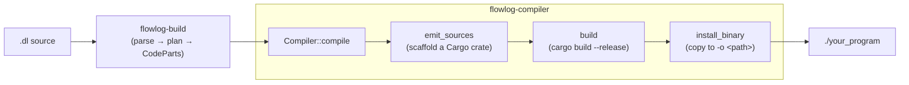

# flowlog-compiler

The **binary-mode** front-end of FlowLog. Produces a standalone Rust executable
from a `.dl` program. This crate is **not published** — it lives in this
workspace and is invoked by the `flowlog` CLI.

> Library mode (compile a `.dl` into your own crate from `build.rs`) is in the
> sister crate [`flowlog-build`](../flowlog-build/). Most of the heavy lifting
> — parser, type checker, stratifier, planner, codegen — lives there. This
> crate only owns the **binary-specific scaffolding**.

## What this crate does



`Compiler::compile` is a two-stage pipeline:

1. **`emit_sources`** — call `flowlog_build::CodeGen` once, then write a
   complete Cargo project under `Config::build_dir`:
   ```text
   <build_dir>/
   ├── Cargo.toml          # rendered from Features (deps gated by what's used)
   ├── .cargo/config.toml  # -Dwarnings so generated code stays clean
   └── src/
       ├── main.rs         # dataflow scope + timely::execute + drain
       ├── relation.rs     # Relation trait + per-EDB input handlers
       ├── cmd.rs / prompt.rs   # incremental-mode REPL only
       ├── udf.rs          # optional, copied from --udf-file
       └── semiring/…      # one file per semiring variant the program uses
   ```
2. **`build`** — shell out to `cargo build --release` in that directory, copy
   the resulting binary to the user-requested `-o <PATH>` (appending `.exe` on
   Windows), and remove the intermediate crate unless `--save-temps`.

## Module layout

| Module | Role |
|---|---|
| `lib.rs` | `Compiler` struct + the `pub fn compile` entry point. |
| `build.rs` | The two-stage pipeline above (`emit_sources` + `build`). |
| `scaffold.rs` | Disk layout of the emitted crate; renders `Cargo.toml` and `.cargo/config.toml` from `Features`. |
| `assembly/` | Final assembly of `main.rs` from the `CodeParts` token-stream bundle. Two assemblers: `batch` (run-once) and `inc` (interactive REPL). |
| `relation.rs` | Renders `src/relation.rs` — the `Relation` trait and per-EDB `Rel{Name}` handlers (input wiring + ingest). |
| `imports.rs` | Computes the `use` block for the emitted `main.rs` based on the program's `Features`. |
| `io/` | Input/output binding helpers used during codegen of the binary's drain path. |
| `main.rs` | The `flowlog-compiler` CLI itself: Clap parsing, then `Compiler::new(...).compile(...)`. |
| `error.rs` | `CompilerError` (wraps `BoxError` + IO failures with friendly hints). |

## Mode matrix

`assembly/` picks the right assembler based on `Config::mode()`:

|              | **Batch** *(`run()` once)* | **Incremental** *(REPL loop)* |
|--------------|----------------------------|--------------------------------|
| **Datalog**  | `batch::gen_batch_main`    | `inc::gen_incremental_main`    |
| **Extended** | same `batch::…`            | same `inc::…`                  |

Extended modes only differ in the planner/codegen stages (allowed `loop {}`
blocks); the assembled shell is identical.

## Where to look first

- Adding a CLI flag → `src/main.rs` (Clap struct).
- Changing the emitted project layout → `src/scaffold.rs`.
- Changing how `main.rs` is stitched together → `src/assembly/{batch,inc}.rs`.
- Anything about *what* code is generated → upstream in
  [`crates/flowlog-build/src/codegen/`](../flowlog-build/src/codegen/).
