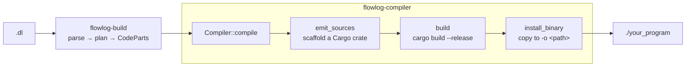

# flowlog-compiler

The **binary-mode** front-end of FlowLog. Produces a standalone Rust executable from a `.dl` program. **Not published** — it lives in this workspace and is invoked by the `flowlog-compiler` CLI.

> Most of the heavy lifting lives upstream in [`flowlog-build`](../flowlog-build/) (parse → plan → codegen). This crate only owns the binary-specific scaffolding.



`Compiler::compile` is two stages:

1. **`emit_sources`** — call `flowlog_build::CodeGen` once, then write a complete Cargo project under `Config::build_dir`:

    ```text
    <build_dir>/
    ├── Cargo.toml          rendered from Features (deps gated by what's used)
    ├── .cargo/config.toml  -Dwarnings so generated code stays clean
    └── src/
        ├── main.rs         dataflow scope + timely::execute + drain
        ├── relation.rs     Relation trait + per-EDB input handlers
        ├── cmd.rs / prompt.rs   incremental-mode REPL only
        ├── udf.rs          optional, copied from --udf-file
        └── semiring/…      one file per semiring variant
    ```

2. **`build`** — shell out to `cargo build --release`, copy the binary to `-o <PATH>` (appending `.exe` on Windows), and remove the intermediate crate unless `--save-temps`.

## Layout

| Module | Role |
|---|---|
| `lib.rs` | `Compiler` struct + the public `compile` entry point. |
| `build.rs` | The two-stage pipeline (`emit_sources` + `build`). |
| `scaffold.rs` | Disk layout of the emitted crate; renders `Cargo.toml` and `.cargo/config.toml` from `Features`. |
| `assembly/` | Final assembly of `main.rs` from `CodeParts`. Two assemblers: `batch` (run-once) and `inc` (interactive REPL). |
| `relation.rs` | Renders `src/relation.rs` — the `Relation` trait + per-EDB `Rel{Name}` handlers. |
| `imports.rs` | Computes the `use` block for the emitted `main.rs` based on `Features`. |
| `io/` | I/O binding helpers used during codegen of the binary's drain path. |
| `main.rs` | The `flowlog-compiler` CLI itself: Clap parsing → `Compiler::new(...).compile(...)`. |
| `error.rs` | `CompilerError` — wraps `BoxError` + IO failures with friendly hints. |

## Mode matrix

`assembly/` picks the assembler from `Config::mode()`:

|              | Batch *(`run()` once)*       | Incremental *(REPL loop)*       |
|--------------|------------------------------|---------------------------------|
| **Datalog**  | `batch::gen_batch_main` ✅   | `inc::gen_incremental_main` ✅  |
| **Extended** | same `batch::…` 🚧           | same `inc::…` 🚧                |

This crate doesn't gate on mode — the partial / experimental status of extended modes lives upstream (see the [top-level README](../../README.md#what-is-it)). Whatever the upstream pipeline accepts, `assembly/` will assemble.

## Where to look first

- Adding a CLI flag → `src/main.rs`.
- Changing the emitted project layout → `src/scaffold.rs`.
- Changing `main.rs` stitching → `src/assembly/{batch,inc}.rs`.
- *What* code is generated → upstream in [`crates/flowlog-build/src/codegen/`](../flowlog-build/src/codegen/).
