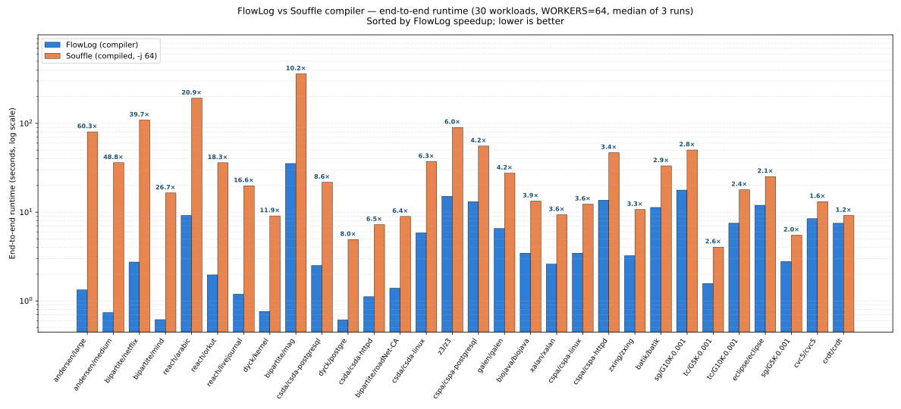

<h1 align="center">FlowLog testing &amp; benchmarking</h1>

<p align="center">
  <em>An in-depth guide to FlowLog's correctness and performance test stack.</em>
</p>

<p align="center">
  <a href="../docs/testing.md"><kbd>Quick overview</kbd></a> &nbsp;·&nbsp;
  <a href="../tools/sweep/README.md"><kbd>Sweep runner</kbd></a> &nbsp;·&nbsp;
  <a href="../docs/perf-snapshot.csv"><kbd>Raw numbers (CSV)</kbd></a>
</p>

<br>

The stack has **four layers**, plus an opt-in fifth (LDBC SNB). Each layer is
cheaper than the next — the cheap ones gate the expensive ones — and a single
entry point (`make sweep`) runs them all in order and emits one
`diagnosis.txt` whose first line is the verdict.

<pre align="center">
<b>L0</b> cargo --workspace  →  <b>L1</b> fixtures  →  <b>L2</b> Souffle oracle  →  <b>L3</b> perf+memory  →  <b>L4</b> LDBC <i>(opt-in)</i>
   ~15 s warm                ~30 min        ~30 min                  hours              hours
</pre>

<br>

---

## Headline result

> **FlowLog vs Soufflé** — 30 workloads, `WORKERS = 64`, median of 3 runs.
> FlowLog wins **30 / 30**, geomean speedup **6.33×**, range **1.22× → 60.30×**.

<p align="center">
  
</p>

<table>
  <tr>
    <td align="center" width="33%"><b>30 / 30</b><br/><sub>workloads where FlowLog wins</sub></td>
    <td align="center" width="33%"><b>6.33×</b><br/><sub>geometric-mean speedup</sub></td>
    <td align="center" width="34%"><b>30 / 0 / 0</b><br/><sub>match · mismatch · n/a (cross-check)<sup>†</sup></sub></td>
  </tr>
</table>

The plot is generated from a real sweep (`result/sweep/20260505-015100/`) — every
engine wrapped in `/usr/bin/time -v`, every output cross-validated against
Souffle for row-count agreement. Six pairs are excluded from the plot because
they are tagged `[souffle:skip]` (no canonical Souffle `.dl` exists for `cc` or
`sssp`; `reach=twitter` is too slow under Souffle's single-threaded input
phase). All 30 baselined pairs cross-validate against Souffle row counts.

> <sup>†</sup> 27 of the 30 matches are exact agreements; the other 3 (`cspa/*`)
> are reported as `match(1)+aux(2)` — both engines compute three relations
> (`ValueFlow`, `MemoryAlias`, `ValueAlias`), but the canonical Soufflé `.dl`
> only `.printsize`s `ValueFlow` (the paper recipe), so we can only directly
> compare one row count. The `+aux(N)` notation marks reporting differences;
> it is **not** a correctness flag.

<details>
  <summary><b>All 30 workload speedups</b> &nbsp;<sub>(click to expand)</sub></summary>

<br>

| # | Workload | FlowLog (s) | Souffle (s) | Speedup | Cross-check |
|--:|---|---:|---:|---:|:---|
|  1 | `andersen/large`       |  1.33 |  80.32 | **60.30×** | match(1)  |
|  2 | `andersen/medium`      |  0.74 |  36.08 | **48.81×** | match(1)  |
|  3 | `bipartite/netflix`    |  2.74 | 108.88 | **39.74×** | match(3)  |
|  4 | `bipartite/mind`       |  0.62 |  16.43 | **26.67×** | match(3)  |
|  5 | `reach/arabic`         |  9.21 | 192.36 | **20.89×** | match(1)  |
|  6 | `reach/orkut`          |  1.97 |  36.00 | **18.32×** | match(1)  |
|  7 | `reach/livejournal`    |  1.19 |  19.82 | **16.61×** | match(1)  |
|  8 | `dyck/kernel`          |  0.76 |   9.07 | **11.92×** | match(3)  |
|  9 | `bipartite/mag`        | 35.27 | 361.31 | **10.24×** | match(3)  |
| 10 | `csda/csda-postgresql` |  2.51 |  21.67 |   8.65×    | match(1)  |
| 11 | `dyck/postgre`         |  0.61 |   4.91 |   8.02×    | match(3)  |
| 12 | `csda/csda-httpd`      |  1.11 |   7.24 |   6.50×    | match(1)  |
| 13 | `bipartite/roadNet-CA` |  1.39 |   8.94 |   6.43×    | match(3)  |
| 14 | `csda/csda-linux`      |  5.84 |  37.10 |   6.35×    | match(1)  |
| 15 | `z3/z3`                | 15.07 |  90.08 |   5.98×    | match(11) |
| 16 | `cspa/cspa-postgresql` | 13.13 |  55.52 |   4.23×    | match(1)+aux(2) |
| 17 | `galen/galen`          |  6.54 |  27.50 |   4.20×    | match(2)  |
| 18 | `biojava/biojava`      |  3.46 |  13.33 |   3.86×    | match(19) |
| 19 | `xalan/xalan`          |  2.60 |   9.36 |   3.60×    | match(19) |
| 20 | `cspa/cspa-linux`      |  3.46 |  12.31 |   3.56×    | match(1)+aux(2) |
| 21 | `cspa/cspa-httpd`      | 13.63 |  46.82 |   3.43×    | match(1)+aux(2) |
| 22 | `zxing/zxing`          |  3.23 |  10.69 |   3.30×    | match(19) |
| 23 | `batik/batik`          | 11.29 |  33.23 |   2.94×    | match(19) |
| 24 | `sg/G10K-0.001`        | 17.72 |  50.15 |   2.83×    | match(1)  |
| 25 | `tc/G5K-0.001`         |  1.57 |   4.04 |   2.57×    | match(1)  |
| 26 | `tc/G10K-0.001`        |  7.51 |  17.90 |   2.38×    | match(1)  |
| 27 | `eclipse/eclipse`      | 11.96 |  25.18 |   2.11×    | match(19) |
| 28 | `sg/G5K-0.001`         |  2.79 |   5.51 |   1.98×    | match(1)  |
| 29 | `cvc5/cvc5`            |  8.44 |  13.14 |   1.56×    | match(11) |
| 30 | `crdt/crdt`            |  7.49 |   9.17 |   1.22×    | match(8)  |

</details>

> [!NOTE]
> **Memory.** FlowLog typically uses 1–3× the peak RSS of Souffle on these
> workloads — that's the cost of differential dataflow's shared arrangements:
> they trade memory for incremental update speed (and the parallelism that
> produces the runtime wins above). On `bipartite/mag` (the largest input,
> 18 GB) FlowLog peaks at 44.5 GB vs Souffle's 21 GB.

<br>

---

## The four layers

### `L0` &nbsp; Workspace unit tests

```bash
cargo test --release --workspace
```

Compiles every crate in the workspace and runs every Rust `#[test]` (~168
across `flowlog-parser`, `flowlog-planner`, `flowlog-build`,
`flowlog-runtime`, `flowlog-compiler`, `flowlog-dl`). The sanity gate.

| | |
|---|---|
| **Time, warm** | `< 15 s` |
| **Time, cold** | `~ 2 min` |
| **Failure mode** | localised — points at one function or one rewrite |

If L0 fails the sweep aborts immediately. No point running fixtures against a
broken parser.

> [!NOTE]
> A pre-flight **safety regression test** (`tests/safety/cleanup_dataset_test.sh`)
> runs ahead of L0 in the sweep — `< 1 s`, 11 assertions. It exercises the
> `cleanup_dataset` env-var contract (`FLOWLOG_KEEP_DATASETS=1` retains;
> a symlinked `FACT_DIR` retains unless `FLOWLOG_FORCE_CLEANUP=1`; a plain
> dir deletes) across all three implementations (L2 / L3 / L4). The guard
> protects the persistent `/datasets/facts/` cache from being `rm -rf`'d
> through a `facts → /datasets/facts` symlink — a regression here would
> silently destroy 100+ GB of cached datasets on the next sweep run, so
> we want it caught first. Invoke standalone with `make test-safety`.

<br>

### `L1` &nbsp; Fixture-level end-to-end &nbsp;·&nbsp; `tests/unit/`

Runs ~95 small hand-curated `.dl` programs **end-to-end** and byte-diffs the
output against pinned `expected/` files. Each fixture is a directory:

```
tests/unit/datalog-batch/<feature>/
├── program.dl                # the program under test
├── data/                     # optional: input CSVs
├── expected/                 # required: one file per .output relation
├── commands.txt              # optional: incremental transcript
└── runtime_flags             # optional: flags forwarded to the binary
```

Coverage spans all four execution modes:

| Subdirectory     | Mode                  | Exercises |
|------------------|-----------------------|-----------|
| `datalog-batch/` | Standard batch        | every aggregation, arithmetic, comparison, join, negation, recursion, type, and UDF feature |
| `datalog-inc/`   | Standard incremental  | `insert / delete / file_load / abort / multi_txn` deltas via `commands.txt` |
| `extend-batch/`  | Extended batch        | `loop` / `fixpoint` blocks under Extended semantics |
| `extend-inc/`    | Extended incremental  | reserved (no fixtures yet) |

> [!IMPORTANT]
> **Two runners exercise the same fixtures via two lowering paths — both must pass.**
> `unit_compiler.sh` builds and runs the `flowlog-compiler` binary;
> `unit_lib.sh` synthesises a small Rust runner crate that links
> `flowlog-build` (build script) + `flowlog-runtime` (engine) and calls
> `engine.run()` directly. Library mode hits a different code path than binary
> mode, so a regression that passes one and fails the other almost always
> points at the build-script ↔ binary-target boundary.

Wall time in the latest sweep: **`unit_compiler` ≈ 1366 s, `unit_lib` ≈ 357 s**.

<br>

### `L2` &nbsp; Souffle oracle on real benchmark programs &nbsp;·&nbsp; `tests/complex/`

For each `program=dataset` pair in `config_integer.txt` (and
`config_string.txt` for `--str-intern` programs), runs FlowLog against the
dataset, then byte-diffs **every `.output` relation** against the
corresponding pre-computed [Souffle](https://souffle-lang.github.io/)
reference output (a tarball auto-fetched from HuggingFace and cached locally
under `tests/complex/cache/`).

> [!TIP]
> Souffle being an **independent Datalog engine** is the key — it makes this
> a real correctness oracle, not a tautology against FlowLog itself. A
> miscompilation that produces wrong tuples will diverge from Souffle at the
> first relation byte; the diff is shown in the failure message.

The 19 program-dataset pairs span three program families:

| Family               | Programs |
|----------------------|----------|
| Graph analysis       | `tc`, `sg`, `reach`, `cc`, `sssp`, `bipartite`, `dyck` |
| Knowledge reasoning  | `crdt`, `galen` |
| Program analysis     | `andersen`, `cspa`, `csda`, `batik`, `biojava`, `eclipse`, `xalan`, `cvc5`, `z3`, `zxing` |

A typical run cross-checks **~140 output relations and ~700 M tuples**. Same
dual binary/library runners as L1 (`datalog_batch_compiler.sh` /
`datalog_batch_lib.sh`).

Wall time in the latest sweep: **compiler ≈ 903 s, lib ≈ 818 s**.

<br>

### `L3` &nbsp; Performance &amp; memory &nbsp;·&nbsp; `tools/benchmark/compare.sh`

For each pair in [`tools/benchmark/config.txt`](../tools/benchmark/config.txt)
(36 pairs at varied scales — small / medium / large datasets), times up to
**four** engines — the previous interpreter (`vldb26-artifact`), the current
compiler (this repo), a library-mode runner, and (when
`--baseline=souffle` or `--baseline=interpreter,souffle`) Souffle — for
`NUM_RUNS` repetitions each, keeps the median. Every run is wrapped in
`/usr/bin/time -v` so peak resident-set size is captured alongside wall time.

| Knob | Default | How to override |
|------|---------|-----------------|
| Workers per engine | `min(64, nproc)` | `WORKERS=N bash compare.sh` &nbsp;or&nbsp; `make sweep WORKERS=N` |
| Timed runs per pair | `3` | `NUM_RUNS=N bash compare.sh` &nbsp;or&nbsp; `make sweep NUM_RUNS=N` &nbsp;or&nbsp; `--num-runs N` |
| Baselines | `interpreter` | `--baseline=souffle` &nbsp;or&nbsp; `--baseline=interpreter,souffle` |
| Resume vs fresh | resume | `--fresh` to wipe `result/benchmark/` first |

**CSV schema** &nbsp;(`result/benchmark/comparison_results.csv`, 26 columns):

| Group         | Columns |
|---------------|---------|
| Identity      | `Program`, `Dataset` |
| Interpreter   | `Interp_{Load, Exec, Total}`, `Interp_PeakRss_MB` |
| Compiler      | `Compiler_{Load, Exec, Total}`, `Compiler_PeakRss_MB` |
| Library mode  | `Lib_{Load, Exec, Total}`, `Lib_PeakRss_MB` |
| Souffle       | `Souffle_{Load, Exec, Total}`, `Souffle_PeakRss_MB` |
| Ratios        | `Compiler_vs_Interp_Total`, `Lib_vs_Compiler_Total`, `Souffle_vs_Compiler_Total` |
| Validation    | `Crosscheck_Souffle` &nbsp;(`match(N)` / `match(N)+aux(M)` / `PARTIAL(N):…` / `MISMATCH:rel=AvsB;…` / `n/a`) |
| Sample count  | `{Interp, Compiler, Lib, Souffle}_RunsSucceeded` &nbsp;(integer K, `0 < K ≤ NUM_RUNS`; empty when the engine wasn't requested for this pair). The diagnosis writer flags rows where any non-empty count is `< NUM_RUNS` as `PARTIAL`. |

> [!IMPORTANT]
> A pair where any **required** engine produces zero successful runs is
> deliberately **not** appended to the CSV. `compare.sh` prints a
> `[PAIR-FAIL]` line, exits non-zero, and leaves the row missing — so a
> resume run (`compare.sh` without `--fresh`) retries the pair instead of
> treating it as permanently complete. Without this gate, a transient
> failure (e.g. one OOM under heavy load) would mask as a permanent
> success on resume.

#### Per-pair tags in `config.txt`

```text
graph_analysis/reach.dl=twitter        [interp:skip] [souffle:skip]
graph_analysis/cc.dl=livejournal       [souffle:skip]
program_analysis/andersen.dl=large
```

| Tag             | Effect |
|-----------------|--------|
| `[interp:skip]` | Skip the legacy interpreter (typically too slow at scale: `twitter`, `arabic`). |
| `[souffle:skip]`| Skip Souffle (no canonical `.dl` available — e.g. `cc`, `sssp` whose paper version uses `min(...)` in the head; or too slow — `twitter`). |

#### `bench_one.sh` — closed-loop perf gate wrapper

Used by external regression gates (e.g. the Groomer agent). Prints two
contract lines on stdout — `<token> <median> <min> <max> <n_runs> <workers>`:

```
elapsed_seconds 1.331829567 1.298745219 1.402938712 3 64
peak_rss_kb     2487436     2412304     2519872     3 64
```

so a gate can opt in to memory tracking by switching `extract_token`
between `elapsed_seconds` and `peak_rss_kb` without changing the parsing
harness. Failures are **fail-closed**: any run whose engine returns
non-zero terminates the wrapper with a non-zero exit code, so a flaky
or broken run cannot silently disappear into the median.

#### Souffle compile recipe &nbsp;<sub>(paper-canonical)</sub>

```bash
souffle -o <bin> -p /dev/null -j N -F <facts> <prog.dl>
```

`-o <bin>` (not `-c`) produces a parallel binary; `-j N` at compile time tells
Souffle to emit `pfor`-macro parallelism (Souffle 2.5+ uses
`#pragma omp for schedule(dynamic)` inside `pfor`, so the generated `.cpp`
contains zero literal `#pragma omp parallel` lines but **is** fully parallel).
A build-time log line confirms libgomp linkage. The same `-j N` is passed to
the runtime binary so input loading and join evaluation use the same thread
budget as FlowLog.

> [!WARNING]
> Souffle's input phase is single-threaded for very large CSVs (`mag` ~18 GB,
> `twitter` ~25 GB). Sampling thread counts mid-load can mislead — the run
> fans out to `N` threads only after CSV ingestion completes.

<br>

### `L4` &nbsp; LDBC SNB &nbsp;<sub>(opt-in)</sub>

`tests/ldbc/ldbc.sh` runs LDBC interactive queries on canonical graph
datasets and compares against DuckDB. Different query family than L1–L3 (no
Datalog programs); not part of the default sweep — pass `--include-ldbc` to
opt in.

<br>

---

## Fairness invariants &nbsp;<sub>(L3)</sub>

| Invariant                                | How it's enforced |
|------------------------------------------|-------------------|
| Same thread budget across all engines    | Single `WORKERS` env, defaulting to `min(64, nproc)`. Forwarded as `--workers` (interp), `-w` (compiler), `WORKERS=` (lib), `-j` (Souffle compile **and** runtime). |
| Same dataset, same input format          | All engines read the same on-disk CSV facts under `<dataset>/facts/` (Souffle via `-F`, FlowLog via `.input`). |
| Same number of repetitions               | `NUM_RUNS=3` median; transient agent bursts are absorbed by the median. |
| Engines run **sequentially**             | They never compete with each other for cores. |
| Output cross-check                       | Free row-count comparison via `Crosscheck_Souffle` column — flips on at L3 because both engines have already produced output by then. |

<br>

---

## Diagnosis report

After a sweep, `result/sweep/<UTC-timestamp>/diagnosis.txt` is written. It
opens with a single-line **VERDICT**:

```text
VERDICT: PASS                      # all layers green, zero anomaly flags
VERDICT: PASS WITH 2 FLAG(S)       # all layers green, but 2 perf/mem regressions
VERDICT: FAIL                      # at least one layer failed correctness
```

followed by a per-step status table (with elapsed seconds and the last log
line or first error per step), the L3 perf-CSV roll-up (Souffle and
cross-check columns included when L3 ran with a Souffle baseline), and a
**Problems flagged** section listing each anomaly category:

| Flag         | Triggers when |
|--------------|---------------|
| `CROSSCHECK` | row-count divergence between FlowLog and Soufflé, or partial output overlap (one engine produced relations the other didn't) |
| `LIB-DRIFT`  | library-mode exec time / compiler-mode exec time outside `[0.7, 1.4]` on the same pair |
| `PERF`       | compiler is **≥ 1.5× slower than Soufflé** on the same pair (`Souffle_vs_Compiler_Total < 0.66`) |
| `MEM`        | compiler peak RSS > 2× interpreter on a pair where both finished |

Exit code is `0` iff every layer that ran returned `0`.

<br>

---

## One entry point

```bash
make smoke          # ~5 min — every layer, tiny subset
make sweep          # full regression sweep (hours; L0+L1+L2+L3, baseline=interpreter)
make sweep-no-perf  # correctness only (L0+L1+L2, no L3)
make perf           # L3 in isolation
make test           # L0 alone
make clean-sweep    # rm -rf result/sweep/
```

For more control, call the runner directly:

```bash
bash tools/sweep/run_full_sweep.sh                              # default
bash tools/sweep/run_full_sweep.sh --smoke                      # tiny subset everywhere
bash tools/sweep/run_full_sweep.sh --skip-l3                    # correctness only
bash tools/sweep/run_full_sweep.sh --include-ldbc               # add L4
bash tools/sweep/run_full_sweep.sh --keep-going                 # don't abort on first fail
bash tools/sweep/run_full_sweep.sh --workers 32                 # override thread budget
bash tools/sweep/run_full_sweep.sh --baseline=souffle --num-runs 3   # produced the chart above
bash tools/sweep/run_full_sweep.sh --baseline=interpreter,souffle    # both engines in the same CSV
```

<br>

---

## Reproducing the headline chart

```bash
cd /home/azureuser/flowlog
source /datasets/env.sh                       # FLOWLOG_KEEP_DATASETS=1
bash tools/sweep/run_full_sweep.sh \
     --baseline=souffle --num-runs 3 --keep-going
# wait ~5–7 hours; then point the renderer at the fresh sweep CSV:
SWEEP_CSV=$(ls -1dt result/sweep/*/comparison_results.csv | head -1)
cp "$SWEEP_CSV" docs/perf-snapshot.csv      # refresh the committed snapshot
python3 docs/render_perf_flowlog_vs_souffle.py "$SWEEP_CSV"
python3 docs/render_perf_snapshot.py        "$SWEEP_CSV"
```

Both render scripts accept either the curated `docs/perf-snapshot.csv`
schema or the raw 22-column `comparison_results.csv` directly, so the
chart can be regenerated against any sweep without a hand-rename step.

Last full sweep producing the chart and table above:
&nbsp;**SHA `408d2dc`**, branch `test-infra/memory-and-sweep`, completed
2026-05-05 06:18 UTC.

<br>

---

## Caching

`tools/benchmark/compare.sh` deletes each dataset after use **unless**
`FLOWLOG_KEEP_DATASETS` is set to a truthy value — `1`, `yes`, `true`, `on`
(any case) — or you `source /datasets/env.sh` on the dev VM. The larger
datasets total **tens of GB** (`arabic`, `orkut`, `livejournal`,
`cspa-postgresql`, `mag`, …); keeping them avoids HuggingFace re-downloads
between sweeps.

**Symlink safety.** When `FACT_DIR` is a symlink (the standard dev-VM
layout has the repo's `facts/ → /datasets/facts/`), cleanup is **always**
skipped — even with `FLOWLOG_KEEP_DATASETS` unset — so a stray sweep can't
`rm -rf` a 100+ GB cache through the symlink. To override and actually
delete through the symlink, set `FLOWLOG_FORCE_CLEANUP=1`. The same
contract is enforced in L2 (`tests/complex/common.sh`), L3
(`compare.sh`), and L4 (`tests/ldbc/ldbc.sh`); a pre-L0 regression test
(`tests/safety/cleanup_dataset_test.sh`, also exposed via
`make test-safety`) keeps the three implementations aligned.
