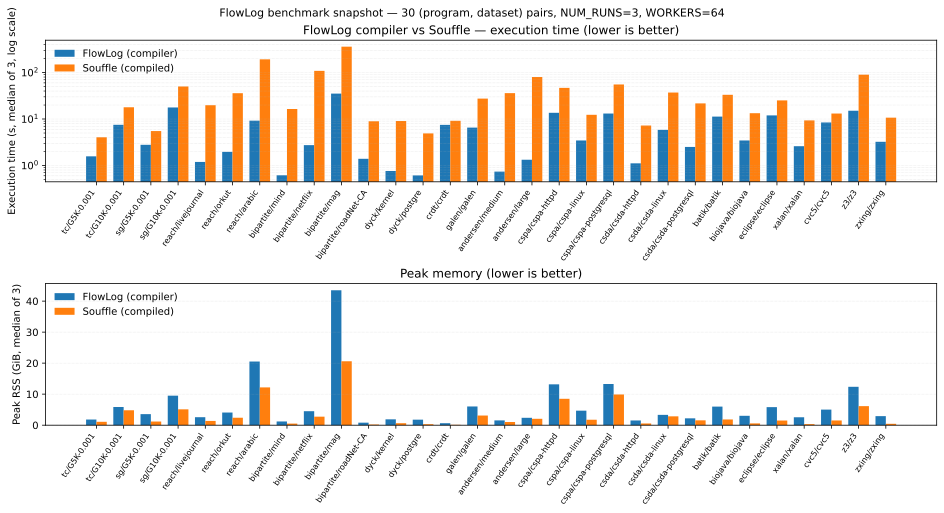

# FlowLog tests

Four suites, each gating the next. Pick a suite, or run them all with `make sweep`.

### L0 — workspace unit tests · `cargo test --release --workspace`

Compiles every crate in the workspace and runs every Rust `#[test]` (~168). This is the cheapest layer — a parser test or a planner unit test failing here usually points at a localized regression. Cached cargo runs in <15 s; full cold ~2 min.

### L1 — fixture-level end-to-end · `tests/unit/`

Runs ~95 small hand-curated `.dl` programs end-to-end and byte-diffs the output against `expected/`. Each fixture is a directory containing `program.dl`, optional `data/` (input CSVs), `expected/` (one file per `.output` relation), an optional `commands.txt` for incremental transcripts, and an optional `runtime_flags`. Coverage spans all four execution modes:

- `datalog-batch/` — standard batch evaluation; every aggregation, arithmetic, comparison, join, negation, recursion, type, and UDF feature.
- `datalog-inc/` — incremental evaluation with a `commands.txt` transcript (insert/delete/file_load/abort/multi_txn deltas).
- `extend-batch/` — `loop` / `fixpoint` blocks under Extended semantics.
- `extend-inc/` — Extended-mode incremental (no fixtures yet — slot reserved).

Two runners exercise the same fixtures via two lowering paths: `unit_compiler.sh` builds and runs the `flowlog-compiler` binary, `unit_lib.sh` synthesizes a Rust runner crate that links `flowlog-build` (build script) and `flowlog-runtime` (engine) and calls `engine.run()`. Both must pass — library mode hits a different code path than binary mode.

### L2 — Souffle oracle on real benchmark programs · `tests/complex/`

For each `program=dataset` pair in `config_integer.txt` (and `config_string.txt` for `--str-intern` programs), runs FlowLog against the dataset, then byte-diffs **every `.output` relation** against the corresponding pre-computed [Souffle](https://souffle-lang.github.io/) reference output (a tarball auto-fetched from HuggingFace and cached locally). Souffle being an independent Datalog engine is the key: it makes this a real correctness oracle, not a tautology against FlowLog itself.

The 19 program-dataset pairs cover graph analysis (`tc`, `sg`, `reach`, `cc`, `sssp`, `bipartite`, `dyck`), knowledge reasoning (`crdt`, `galen`), and program analysis (`andersen`, `cspa`, `csda`, `batik`, `biojava`, `eclipse`, `xalan`, `cvc5`, `z3`, `zxing`). A typical run cross-checks ~140 output relations and ~700 M tuples. Same dual binary/library runners as L1.

### L3 — performance & memory · `tools/benchmark/compare.sh`

For each pair in `tools/benchmark/config.txt` (~33 pairs at varied scales — small/medium/large datasets), times **three** binaries — the previous interpreter (`vldb26-artifact`), the current compiler (this repo), and a library-mode runner — for `NUM_RUNS=3` repetitions each, then keeps the median. Every run is wrapped in `/usr/bin/time -v` so peak resident set size is captured alongside wall time. Output: `result/benchmark/comparison_results.csv` with `*_Load`, `*_Exec`, `*_Total` (seconds) and `*_PeakRss_MB` (MiB) for all three binaries plus pre-computed speedup ratios.

`bench_one.sh` is the per-pair wrapper used by closed-loop perf gates (e.g. Groomer); it prints two contract lines on stdout — `elapsed_seconds` and `peak_rss_kb` — so a regression gate can opt in to memory tracking by switching `extract_token`.

### L4 — LDBC SNB · `tests/ldbc/ldbc.sh` (opt-in)

LDBC interactive queries on canonical graph datasets, compared against DuckDB. Different query family than L1–L3; not part of the default sweep — pass `--include-ldbc` to opt in.

## Snapshot

A representative sweep across six pairs spanning all three program families (graph analysis, knowledge reasoning, program analysis) at small / medium / large scales:



Median over five runs at WORKERS=64. Numbers in [`docs/perf-snapshot.csv`](../docs/perf-snapshot.csv); regenerate with `python3 docs/render_perf_snapshot.py` after a fresh sweep.

## Running

```bash
make smoke          # ~5 min — every suite, tiny subset
make sweep          # full regression sweep (hours)
make sweep-no-perf  # correctness only (skip L3)
make test           # cargo test --release --workspace
make perf           # L3 in isolation
```

`tools/sweep/run_full_sweep.sh` is the underlying script; flags `--smoke / --skip-l3 / --include-ldbc / --keep-going` are documented in [`tools/sweep/README.md`](../tools/sweep/README.md). Output: `result/sweep/<ts>/diagnosis.txt` (per-step status, elapsed, last-line-or-error, and a perf-CSV roll-up).

## Caching

`compare.sh` deletes each dataset after use unless `FLOWLOG_KEEP_DATASETS=1` (or `source /datasets/env.sh` on the dev VM). Tens of GB if you retain the larger datasets (`arabic`, `orkut`, `livejournal`, `cspa-postgresql`, …).
